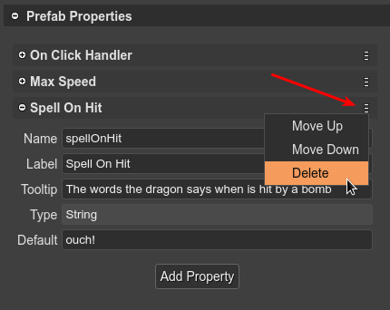

.. include:: ../_header.rst

Prefab user properties
~~~~~~~~~~~~~~~~~~~~~~

As we mentioned in previous sections, a prefab_ extends a Phaser_ built-in type or another prefab_. This means a prefab_ inherits the properties defined in the Phaser_ built-in types. However, you have the option to define new properties.

With prefab_ user properties, you can create more reusable prefabs_. You can express gameplay concepts: the "health" of a player, the "value" of a coin, the "speed" of an enemy, etc.


Creating a prefab user property
```````````````````````````````

The **Prefab Properties** section of the |InspectorView|_ shows a button to create a new user property. This section is shown when you select the scene (click on a blank space of the scene).

Click on the **Add Property** button to create a new property. The button shows a menu with the different type of properties:

.. image:: ../images/prefab-user-props-add-property-06062020.webp
    :alt: Add prefab user property.

All type of properties requires some common parameters that you should provide:

* The **Name** of the property. It is used by the compiler to generate a property declaration code. It should be a valid JavaScript identifier.
* The **Label**. It is a UI friendly version of the **Name**. For example, the label for the **maxSpeed** name could be **Maximum Speed**. In code, is generated a **maxSpeed** field, but the UI shows **Maximum Speed**.
* The **Tooltip**. Used in the UI as documentation of the property.
* The **Default** value. 

.. image:: ../images/prefab-user-props-common-params-06062020.webp
    :alt: Common parameters of a property.

In the title bar of the property, there is a menu with commands to delete the property or move it up/down. You can undo/redo all changes in the properties.



.. topic:: Simple property type

    The **Number** and **String** properties are the simplest. The |SceneCompiler|_ generates fields like this:

    .. code::

        class Dragon extends Phaser.GameObjects.Sprite {
            ...
            public maxSpeed: number = 100;
            public spellOnHit: string = "ouch!";
            ...
        }

.. topic:: Option property type

    The Option type allows the user to select one of the predefined string values. It is like traditional enum types. In addition to the common parameters, the Option properties have the **Options** parameter. You should write all the possible values with a valid JSON array syntax:

    .. image:: ../images/prefab-user-props-options-param-06062020.webp
        :alt: The Options parameter of the Option property.
    
    Note the **Default** value should be one of the possible values. 
    
    The compiled property is like this:

    .. code::

        class Dragon extends Phaser.GameObjects.Sprite {
            ...
            public flameType: "fire"|"smoke"|"laser" = "fire";
            ...
        }        

.. topic:: Expression property type

    The Expression type is the way you have to create a property of any type. You can use any type for the values and any JavaScript expression for setting the values. For example, you can use it to create a property to reference an event handler (or callback function):

    .. image:: ../images/prefab-user-props-expression-param-06062020.webp
        :alt: Expression property declaration.
    
    The |SceneCompiler|_ generates Expression properties like this:

    .. code::

        class Dragon extends Phaser.GameObjects.Sprite {
            ...
            public onClickHandler: (obj:Dragon) => void = obj => {};
            ...
        }

User properties in a prefab instance
````````````````````````````````````
This is how the properties you defined in a prefab_ are presented in the **Prefab Instance** section of a prefab_ instance:

.. image:: ../images/prefab-user-props-prefab-instance-06062020.webp
    :alt: User properties in a prefab instance.

The user properties are shown just like any other property of a prefab_ instance.

The code, generated by the |SceneCompiler|_, that creates the prefab_ instance and initialize the properties will look like this:

.. code::

    class Level extends Phaser.Scene {
    ...
        create() {
            ...
            // dragon
            const dragon = new Dragon(this, 370, 218);
            this.add.existing(dragon);
            dragon.maxSpeed = 300;
            dragon.flameType = "smoke";
            dragon.onClickHandler = obj => this.selectDragon(obj);
            ...
        }
    ...
    }

In the next sections are covered the topics to create prefab_ instances and to change the properties.