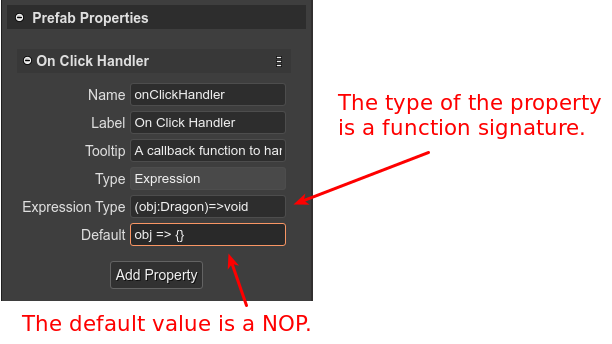

.. include:: ../_header.rst

Prefab user properties
~~~~~~~~~~~~~~~~~~~~~~

As we mentioned in previous sections, a prefab_ extends a Phaser_ built-in type or another prefab_. This means a prefab_ inherits the properties defined in the Phaser_ built-in types. However, you have the option to define new properties.

With prefab_ user properties, you can create more reusable prefabs_. You can express gameplay concepts: the "health" of a player, the "value" of a coin, the "speed" of an enemy, etc.


Creating a prefab user property
```````````````````````````````

The **Prefab Properties** section of the |InspectorView|_ shows a button to create a new user property. This section is shown when you select the scene (click on a blank space of the scene).

Click on the **Add Property** button to create a new property. The button shows a menu with the different type of properties:

.. image:: ../images/prefab-user-props-add-property-09102020.webp
    :alt: Add prefab user property.

All type of properties requires some common parameters that you should provide:

* The **Name** of the property. It is used by the compiler to generate a property declaration code. It should be a valid JavaScript identifier.
* The **Label**. It is a UI friendly version of the **Name**. For example, the label for the **maxSpeed** name could be **Maximum Speed**. In code, is generated a **maxSpeed** field, but the UI shows **Maximum Speed**.
* The **Tooltip**. Used in the UI as documentation of the property.
* The **Default** value. 

.. image:: ../images/prefab-user-props-common-params-06062020.webp
    :alt: Common parameters of a property.

In the title bar of the property, there is a menu with commands to: 

    * Move the property down/up.
    * Change the type of the property.
    * Delete the property.
    
You can undo/redo all these changes.

.. image:: ../images/prefab-user-props-menu-09102020.webp
    :alt: Property menu. 

Simple property type
''''''''''''''''''''

The **Number** and **String** properties are the simplest. The |SceneCompiler|_ generates the fields like this:

.. code::

    class Dragon extends Phaser.GameObjects.Sprite {

        constructor(scene, x, y, texture, frame) {
            super(...);

            ...

            /** @type {number} */
            this.maxSpeed = 100;
            /** @type {"fire"|"smoke"|"laser"} */
            this.flameType = "fire";
            /** @type {(obj:Dragon)=>void} */
            this.onClickHandler = obj => {};
        }            
    }

Option property type
''''''''''''''''''''

The Option type allows the user to select one of the predefined string values. It is like traditional enum types. In addition to the common parameters, the Option properties have the **Options** parameter. You should write all the possible values with a valid JSON array syntax:

.. image:: ../images/prefab-user-props-options-param-06062020.webp
    :alt: The Options parameter of the Option property.

Note the **Default** value should be one of the possible values. 

The compiled property is like this:

.. code::

    class Dragon extends Phaser.GameObjects.Sprite {
        
        constructor(...) {
            super(...);                
            ...
            /** @type {"fire"|"smoke"|"laser"} */
            this.flameType = "fire";
        }
    }        

Expression property type
''''''''''''''''''''''''

The Expression type is the way you have to create a property of any type. You can use any type for the values and any JavaScript expression for setting the values. For example, you can use it to create a property to reference an event handler (or callback function):



The |SceneCompiler|_ generates Expression properties like this:

.. code::

    class Dragon extends Phaser.GameObjects.Sprite {
        
        constructor(..) {
            ...
            /** @type {(obj:Dragon)=>void} */
            this.onClickHandler = obj => {};
        }
    }

Texture Config property type
''''''''''''''''''''''''''''

This type of property allows to select a texture between all the textures defined in the an |AssetPackFile|. When the texture is selected, the property gets as value the configuration of the texture. For example, if the selected texture is an image with key **background**, the property is set to:

.. code:: 
    
    { "key": "background" } 

If the selected texture is the frame **branch-01** of the atlas **atlas-props**, then the property is set to: 

.. code::

    { "key": "atlas-props", "frame": "branch-01" }

.. image:: ../images/prefab-user-props-texture-config-param-09102020.webp
    :alt: The Texture Config property.

The |SceneCompiler|_ generates Texture Config properties like this:

.. code::

    class Dragon extends Phaser.GameObjects.Sprite {
        
        constructor(..) {
            ...
            /** @type {{key:string,frame?:string|number}} */
            this.myTexture = {"key":"atlas-props","frame":"branch-01"};
        }
    }

Asset Key property type
'''''''''''''''''''''''

The Asset Key property type is just like a simple String property type, but it allows to open a dialog with all the |AssetPackFile|_ keys defined in the project. Then, when you select a key in the dialog, it will be set as value to the property.

.. image:: ../images/prefab-user-props-asset-key-param-09102020.webp
    :alt: Select asset key value.

The |SceneCompiler|_ generates Asset Key properties like this:

.. code::

    class Dragon extends Phaser.GameObjects.Sprite {
        
        constructor(..) {
            ...
            /** @type {string} */
            this.myAssetKey = "acorn-3";
        }
    }

Animation Key property type
'''''''''''''''''''''''''''

This type is just like the `Asset Key property type`_ but the dialog only shows the animations defined in the project:

.. image:: ../images/prefab-user-props-animation-key-param-09102020.webp
    :alt: The Animation Key property.

Audio Key property type
'''''''''''''''''''''''

This type is like the `Asset Key property type`_ but the dialog only shows the audio assets:

.. image:: ../images/prefab-user-props-audio-key-param-09102020.webp
    :alt: Audio Key property type.

Initializing other properties
'''''''''''''''''''''''''''''

Is possible you want to change other properties of the prefab instance, in dependence of the values of the user properties. For example, if the **flameType** property value is ``"fire"``, then you set the mass of the body to 50. Because the property values are not set in the constructor, you can listen to the scene update event and setup the body properties:

.. code::

    class Dragon extends Phaser.GameObjects.Sprite {
        
        constructor(scene,...) {
            ...

            /* START-USER-CTR-CODE */
            scene.events.once(Phaser.Scenes.Events.UPDATE, this.start, this);
            /* END-USER-CTR-CODE */
        }

        /* START-USER-CODE */

        start() {
            
            // at this point, the instance was created and the user properties set with new values

            if (this.flameType === "fire") {
                this.body.mass = 50;
            }
        }

        /* END-USER-CODE */
    }

The **UPDATE** event is emitted by the scene at every tick, so we just need to register the listener to be called **once**.

User properties in a prefab instance
````````````````````````````````````
This is how the properties you defined in a prefab_ are presented in the **Prefab Instance** section of a prefab_ instance:

.. image:: ../images/prefab-user-props-prefab-instance-06062020.webp
    :alt: User properties in a prefab instance.

The user properties are shown just like any other property of a prefab_ instance.

The code, generated by the |SceneCompiler|_, that creates the prefab_ instance and initialize the properties will look like following. Note the **dragon** instance is created first, and the user properties are initialized later, at the end of the method. By setting the user properties at the end, it allows you to set references to another objects created in the scene:

.. code::

    class Level extends Phaser.Scene {
    ...
        create() {            
            ...
            
            // dragon
            const dragon = new Dragon(this, 370, 218);
            this.add.existing(dragon);

            ...

            // dragon (prefab fields)
            dragon.maxSpeed = 300;
            dragon.flameType = "smoke";
            dragon.onClickHandler = obj => this.selectDragon(obj);
            ...
        }
    ...
    }

In the next sections are covered the topics to create prefab_ instances and to change the properties.