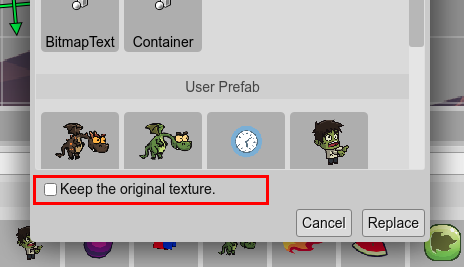

.. include:: ../_header.rst

Replacing the type of an object
-------------------------------

When you drop a |BlocksView|_ item into the scene, a new object is created. If the item you drop is an image or atlas frame, it creates an `Image <image-object.html>`_ object.

However, you can change the type of the `Image`_ object to another, like a `Sprite <sprite-object.html>`_ or `TileSprite <tile-sprite-object.html>`_. You can convert any type of object to any other type. We name it object type replacement.

To replace the type, execute the **Replace Type** command that is shown in the **Type** sub-menu of the context menu. That command opens the **Replace Type** dialog. The dialog shows the different types supported by the editor, including your prefabs_. Select the new type and press **Replace**.

For example, you can convert a `Text <text-object.html>`_ object to a `BitmapText <bitmap-text-object.html>`_:

#. Select the `Text`_ object, open the context menu and launch the **Replace Type** dialog:

    .. image:: ../images/scene-editor-replace-type-1-04262020.webp
        :alt: Open the Replace Type dialog.

#. In the **Replace Type** dialog, select the `BitmapText`_ type. It opens the **Select Bitmap Font** dialog. Select the desired font for the new object (you cannot create a `BitmapText`_ object without a font):

    .. image:: ../images/scene-editor-replace-type-2-06092020.webp
        :alt: Select the font for the new BitmapText.

#. Finally, the object is converted to a `BitmapText`_. Note the properties shared by both types are conserved the same. The `Text property <text-property.html>`_ is an example of that:

    .. image:: ../images/scene-editor-replace-type-3-04262020.webp
        :alt: Converted to BitmapText.

Keeping the original texture
~~~~~~~~~~~~~~~~~~~~~~~~~~~~

The **Replace Type** dialog has the option of keep the original texture when you are replacing an image object with a prefab_ type. By default, the object will get the texture of the prefab_. However, if you select the **Keep the original texture** option, after the type replacing, the object will unlock the texture property and use the original texture.

