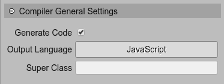

.. include:: ../_header.rst

General settings
~~~~~~~~~~~~~~~~

The |SceneCompiler|_ uses two different sets of parameters to refine the code generation of a Phaser_ scene and a prefab file. However, there are general, or shared settings, used in both cases:

The parameters:

* **Generate Code**: un-check it if you don't want the compiler to compile the file. In the `Using a prefab as a black box <prefab-black-box.html>`_ section there is an example that uses a scene file without code generation.

* **Output Language**: you can select if the scene is compiled into JavaScript or TypeScript. In case you select TypeScript, you need to compile yourself the TypeScript generated files, with the TypeScript compiler (``tsc``).

* **Super Class**: you can force the generated class (prefab or scene), to extends the given class. If empty, the compiler will detect the appropriate class.

By the way, the name of the file and the class that is generated by the compiler is the same as the scene file. For example, a ``Zombie.scene`` file is compiled into ``Zombie.js`` (or ``Zombie.ts``) and the name of the class will be ``Zombie``.
