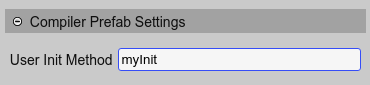
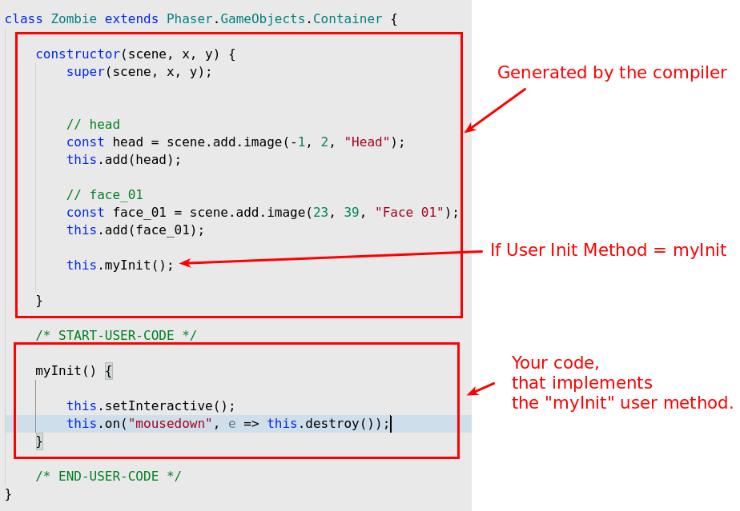

.. include:: ../_header.rst

Prefab settings
~~~~~~~~~~~~~~~

The compilation of a prefab_ file is different from a regular scene file. A prefab_ file is compiled into a class that extends a Phaser_ Game Object. There is not a **create** or **preload** method. The objects and properties are initialized in the prefab_ constructor.

If you need to change something more in the constructor, then you can set the **User Init Method** parameter in the **Compiler Prefab Settings**:

If you set that parameter, then a call to the method is generated at the end of the prefab_ constructor:

By default, the **User Init Method** is empty, and the compiler does not generate a "user init method" call at the end of the constructor.