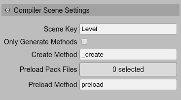

.. include:: ../_header.rst

Scene settings
~~~~~~~~~~~~~~

The compilation of a Phaser_ scene can be tweaked with the **Compiler Scene Settings**:

* **Scene Key**: you can set the `Phaser.Scene configuration key <https://photonstorm.github.io/phaser3-docs/Phaser.Types.Scenes.html#.SettingsConfig>`_. Is optional.

* **Only Generate Methods**: if checked, instead of generate a `Phaser.Scene <https://photonstorm.github.io/phaser3-docs/Phaser.Types.Scenes.html>`_ class, the compiler generates only the **create** and **preload** methods:

    .. image:: ../images/scene-compiler-scene-settings-only-methods-04272020.webp
        :alt: Only generate methods.

    This could be useful if you want to create the objects using any context:

    .. code::

        create.call(anySceneLikeContext);

* **Create Method**: by default it is ``create``, but you can change it and write your own create method. For example, if you need to execute some code before or after the scene "create" method, you can set **Create Method** equals to ``editorCreate``, and write your own ``create`` method:

    .. code::

        /* START OF COMPILED CODE */

        class Level2 extends Phaser.Scene {
            
            constructor() {
                super("Level2");
                
            }
            
            editorCreate() {      

                // dino
                const dino = this.add.image(346, 233, "dino");
                
                // fields
                this.dino = dino;                
            }
            
            /* START-USER-CODE */

            // this is the method called by Phaser, when the scene is created.
            create() {

                // first, I create the objects generated by the editor
                this.editorCreate();

                // then I do something with the objects
                this.input.enable(this.dino);
                this.dino.on("keydown", e => this.dino.destroy());
            }

            /* END-USER-CODE */
        }

        /* END OF COMPILED CODE */

* **Preload Pack Files**: you can select the pack files to be loaded in the scene. If you click on the button, it opens the **Select Pack Files** dialog:

    .. image:: ../images/scene-compiler-scene-settings-load-pack-file-04272020.webp
        :alt: Load asset pack files.

 If you select to load a pack file, then the compiler generates a **preload** method:

    .. code::

        class Level extends Phaser.Scene {
	
            preload() {                
                this.load.pack("asset-pack", "assets/asset-pack.json");                
            }

            create() {
                // ...
            }
        }

* **Preload Method**: like the **Create Method**, you can change the name of the **preload** method generated by the compiler. Then, you can write your own **preload** method and call the one of the editor.