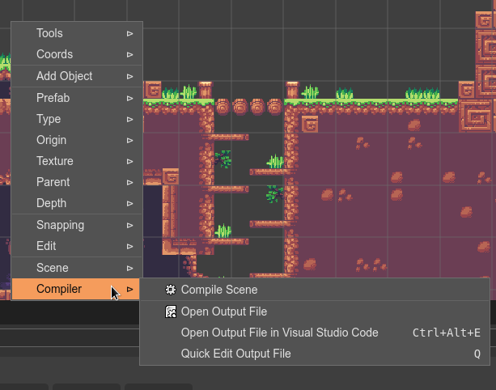
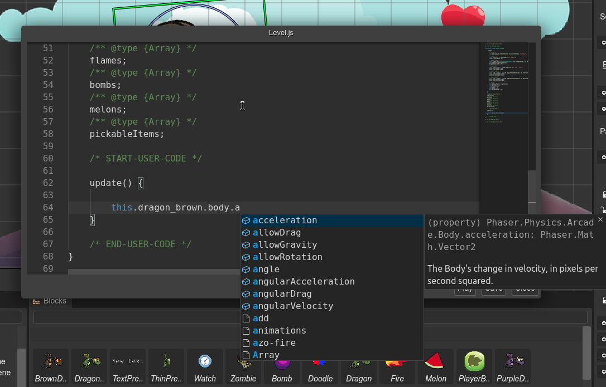

.. include:: ../_header.rst

User code
~~~~~~~~~

The |SceneEditor|_ helps to build game levels, but it is far away to cover all aspects of a game. Especially, the game logic should be implemented by you, writing code.

In Phaser_ programming, it is common to see, in the same file, code to create the objects of the level (what the |SceneEditor|_ is good for) and code to handle the interaction between the objects (the game logic, that is not targeted by the |SceneEditor|_).

We designed the |SceneCompiler|_ to allow you to merge the generated code with your code, in the same file.

The concept is simple:

* The |SceneCompiler|_ creates the initial JavaScript file.

* The initial file contains protected regions, where the user can insert its code. These regions are delimited by JavaScript comments like ``/* START-USER-CODE */`` and ``/* END-USER-CODE */``.

* You can insert your code inside the protected regions. 

* The next time the file is updated by the compiler, the user protected regions are preserved, it means, your code is not changed, only the code generated by the compiler is updated.

The |SceneCompiler|_ uses different comments to delimit the user code:

* From the beginning of the file to the start of the ``/* START OF COMPILED CODE */`` comment.

* From the end of the ``/* END OF COMPILED CODE */`` comment to the end of the file.

* From the end of the ``/* START-USER-CODE */`` comment to the start of the ``/* END-USER-CODE */`` comment.

The next image is an example. Note that you can write an ``update()`` method with the game logic:

.. image:: ../images/scene-compiler-user-code-04272020.webp
    :alt: User code.

Editing the generated code
``````````````````````````
The code generated by the |SceneCompiler|_ can be edited in an external editor (like |VSCode|_) or using the |MonacoEditor|_ that is built-in in |PhaserEditor|_.

We recommend you to read the |CodeEditor|_ chapter and the `Advanced JavaScript editing features <../code-editor/js-editor-advanced-features.html>`_ section.

The |SceneEditor|_ provides two commands to quickly edit the code file generated by the |SceneCompiler|_:



The **Open Output File** command opens the generated file in a new |CodeEditor|_, in the traditional way.

The **Open Output File in VS Code** (``Ctrl+Alt+E``) command launches a local |VSCode|_ instance (or any other configured external editor) that opens the generated file.

The **Quick Edit Output File** command (bound to the ``Q`` key) opens the generated file in a |CodeEditor|_ that is embedded in a modal dialog. This way is perfect for quick modifications, however, intellisense and all the other |MonacoEditor|_ features are enabled, so you have a similar experience in comparison with the traditional way of editing.

