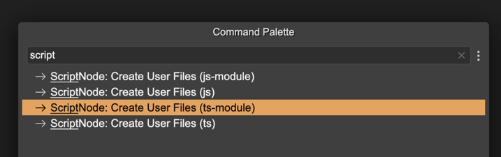
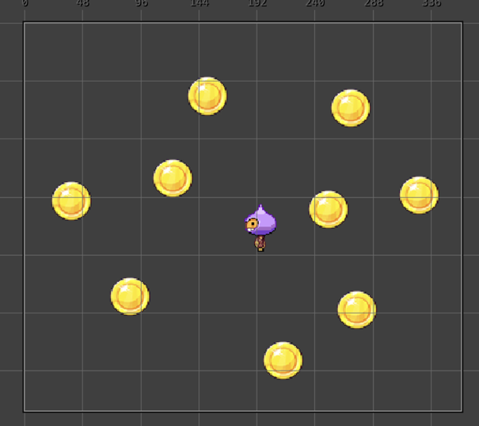
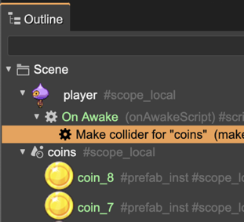
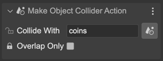
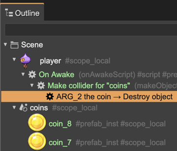
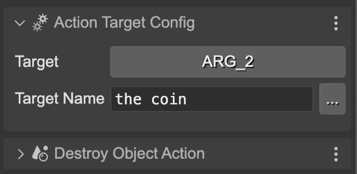

.. include:: ../_header.rst

The ScriptNode class
~~~~~~~~~~~~~~~~~~~~

When you create an instance of a |ScriptNode|_, the |SceneCompiler|_ generates a code like this:

.. code::

 new ScriptNode(parent);

It means it creates an instance of the ``ScriptNode`` class. But this class is not part of the Phaser_ API, it is a class you should code yourself.

The protocol of this class is simple, it needs a constructor that receives a parent argument. Something like this:

.. code::

 class ScriptNode {

    constructor(parent) {
    }
 }

It is simple, but if you need to, you can create a prefab with more features, like handling children, events, etc...

The good news is that this class is included in the |PhaserEditor|_ project templates. If your project is not based on a template, you can install it from the ``@phasereditor2d/scripts-core`` script library. `Learn more about the script libraries <script-node-libraries.html>`_.  

Also, |PhaserEditor|_ can generate the default implementation of this class for you, with the basic features:

1. In the |FilesView|_, select the folder when you want to add the class file.
2. Open the |CommandPalette|_ (``Ctrl+K``) and search for ``script``.
3. Select the command with the desired format (TypeScript, JavaScript, ES modules,...).
4. **Execute** the command and it generates the class file in the selected folder.



This built-in class the editor provides contains a couple of features:

* Keeps a reference to the scene, the game object, and the parent.
* Manages an array of the children nodes.
* Registers listeners to the scene and game object for implementing the **awake**, **start**, **update**, and **destroy** events. It follows the same logic as the `User Components events <./user-components-super-class.html>`_.
* Provides an interface for "action nodes".

The parent
``````````

When a new instance of the ``ScriptNode`` class is created, it receives a parent node as an argument. This parent could be a scene, a game object, or another script node.

The script node instance keeps a reference to the parent, but also keeps a reference to the game object and the scene. Sure, if the node is added to a scene, the game object reference is not updated, it keeps ``undefined``.

Related to the parent, the class provides the following properties:

- ``parent()``: it's type is ``Phaser.Scene | Phaser.GameObjects.GameObject | ScriptNode``.
- ``gameObject()``: it's type is ``Phaser.GameObjects.GameObject | undefined``.
- ``scene()``: it's type is ``Phaser.Scene``.

The children
````````````

The ``ScriptNode`` class has an array of nodes for keeping the children. This array is updated when a new node is created. It also provides some related methods:

* ``children ()``: A property for iterating the children.
* ``add()``: A method for adding new children. This method is called automatically when a new child is created.

The events
``````````

The ``ScriptNode`` class provides a couple of methods for handling special events that may help you implement the behaviors. It works just like the `User Components events`_. The methods are:

- ``awake()``: It is called when all the objects of the scene are created. The values of the user properties (prefab) will be available at this time, so you can override this method for making computations that require the value of the properties. It works like the `UserComponent "awake" method <user-components-awake-event.html>`_.
- ``start()``: It is called the first time the scene updates.
- ``update()``: It is called each time the scene updates.
- ``destroy()``: It is called when the game object is destroyed or the scene is shut down.


The action methods
``````````````````

We find it convenient to establish a protocol for action script nodes. An action script is a script node that will execute a certain task. For that purpose, the class provides the following methods:

- ``execute()``: Contains the code of the action.
- ``executeChildren()``: Executes the children.

In the next chapter, we mention a project with basic node implementations that you can include in your game. These scripts provide a protocol or style you can adopt for your game.

The action's target
```````````````````

Most of the action nodes modify or read the game object of the node. This is fine for a lot of cases, but a bit limited. Let's see an example.

You want to make a collider between a player object and a list of coin objects and destroy the coin when the player touches it:




We have a **Make Collider Action** node that you can add to the player. This node has a parameter to select the other object you want to collide with. In this case, it is a container with the coins:





When the collision happens, the collider node executes the children and passes the two objects as arguments. In the first argument goes the player, and in the second argument goes the coin.

So, we add **Destroy Object Action** to the collider node. This node is an action to destroy an object. By default, it destroys the game object associated with it: the player. But we want to destroy the coin, not the player. So we need to change the target of the destroy action from the game object to the second argument.

To do this, we add the **Action Target Config** user component to the destroy object action, and set the **Target** to **ARG_2**. The destroy action then will get the second argument and destroy it.





The **Target** parameter shows an array of options, **GAME_OBJECT** (default), **ARG_1**, ..., **ARG_8**.

In addition to the **Target**, you can set the **Target Name** of the action. This name is only about syntax sugar and makes the node more readable in the Outline view.

Custom action script node
`````````````````````````

Making a new action node is very simple. Just create a prefab of a **Script Node**, and implement the ``execute()`` method. If you want to support the **Action Target Config** component, you can use the ``ScriptNode.getActionTargetObject()`` utility method:

.. code:: 

   execute(...args: any[]) {

      const obj = this.getActionTargetObject(args);

      obj.doSomething();
   }

That utility method does the following:

- Check if the **Action Target Config** user component is present in the node. If it is present and has a target configured to return an argument, then returns the right argument.
- Else, it returns the node's game object.