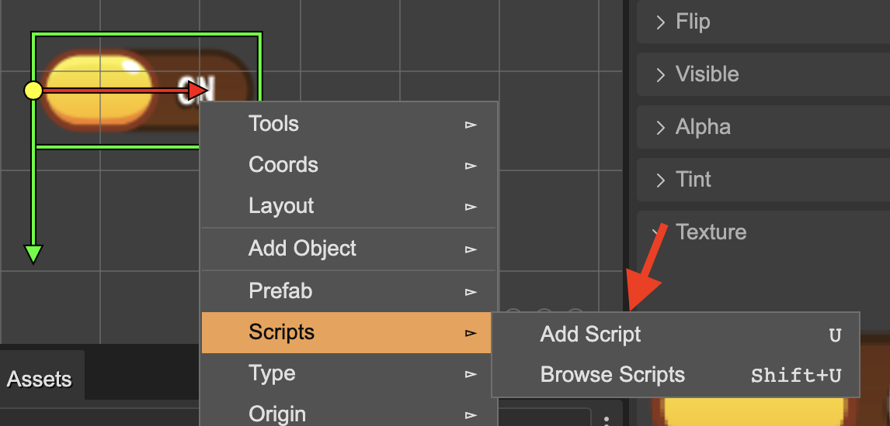

.. include:: ../_header.rst

Creating a Script Node
~~~~~~~~~~~~~~~~~~~~~~

A |ScriptNode|_ object shares a lot with the game objects, you can add it to the scene by dragging it from the |BlocksView|_ and dropping it on the scene:


That action creates an instance of the `ScriptNode class <./script-node-class.html>`_ and adds it to the object selected in the scene. If no object is selected, then it adds the script node to the scene.

In addition to an instance of the `ScriptNode class`_, you can add an instance of a `ScriptNode prefab <./script-node-prefab.html>`_. The script node prefabs are shown next to the other prefabs in the |BlocksView|_:


another way of adding a script node is by selecting the **Add Script** option in the **Script** context menu. It is also available as a command (``U``).



It opens the **Add Script** dialog. There you can select the script you want to add:


Browsing the Script Nodes
`````````````````````````
The |ScriptNodes|_ are displayed in the |OutlineView|_, below the parent object, or the scene:


Also, you can browse the scripts of an object by pressing the command ``Shift+U``. The command is also available in the **Script** section of the context menu. That command opens the **Browse Scripts** dialog:


Code generation of the creation of a script
```````````````````````````````````````````

When you add a |ScriptNode|_ to an object, it generates a code like this:

.. code::

 editorCreate() {
 
 // btn
 const btn = this.add.image(359, 223, "ui", "btn.png");

 // onPointerDownScript
 new OnPointerDownScript(btn);
 ...
 }

It is the code generated by the |SceneCompiler|_ when you add a script node prefab. If you add an instance of the built-in ScriptNode, the code is similar, but using the `ScriptNode class`_:

.. code::

 editorCreate() {
 
 // btn
 const btn = this.add.image(359, 223, "ui", "btn.png");

 // scriptnode_1
 new ScriptNode(btn);
 ...
 }

The **ScriptNode** class is not part of |Phaser|_, but it could be generated by Phaser Editor 2D. The next section is about it.