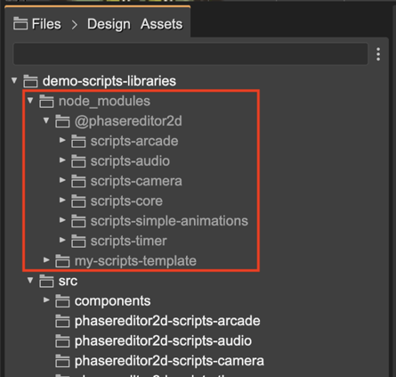

.. include:: ../_header.rst

Script Nodes libraries
~~~~~~~~~~~~~~~~~~~~~~

In v3.65 of |PhaserEditor|_ we introduced the scripts libraries. A script library is a Node module you can install in your project. It works just like any other Node library. You can create common behaviors for your games and distribute them as a Node library.

In |PhaserEditor|_ we created a few libraries with basic behaviors. We should keep working on these libraries adding more behaviors:

* `@phasereditor2d/scripts-core <https://github.com/PhaserEditor2D/phasereditor2d-scripts-core>`_: Contains the basic scripts and user components for every game or any other script libraries. It is included by default in all the Webpack-based project templates.
* `@phasereditor2d/scripts-simple-animations <https://github.com/PhaserEditor2D/phasereditor2d-scripts-simple-animations>`_: Contains a few scripts and user components for performing simple animations, like pushing a button, or fade-in an object.
* `@phasereditor2d/scripts-simple-animations <https://github.com/PhaserEditor2D/phasereditor2d-scripts-audio>`_: Contains a few scripts and user components for audio playback.
* `@phasereditor2d/scripts-arcade <https://github.com/PhaserEditor2D/phasereditor2d-scripts-arcade>`_: Contains a few scripts for changing the physics of objects.
* `@phasereditor2d/scripts-camera <https://github.com/PhaserEditor2D/phasereditor2d-scripts-camera>`_: Contains scripts for handling the Camera, like applying camera effects or starting following an object.
* `@phasereditor2d/scripts-timer <https://github.com/PhaserEditor2D/phasereditor2d-scripts-timer>`_: Contains scripts for performing delayed actions.

Please, check every repository for detailed information.

Installing a script library
===========================

As we mentioned before, the script libraries are just Node modules, and you install them as any other node module:

.. highlight:: bash

.. code:: 

  npm install @phasereditor2d/scripts-camera

The next step is to add the library to the ``scripts`` section of the ``phasereditor2d.config.json`` file:

.. highlight:: javascript

.. code:: 

  {
      "plugins": [],
      "scripts": [
          "@phasereditor2d/scripts-core",
          "@phasereditor2d/scripts-simple-animations",
          "@phasereditor2d/scripts-audio",
          "@phasereditor2d/scripts-arcade",
          "@phasereditor2d/scripts-camera",
          "@phasereditor2d/scripts-timer"
      ],
      "skip": [
          "dist"
      ],
      "playUrl": "http://localhost:8080"
  }

You can check the libraries are installed in the |FilesView|_:



If you look inside the libraries, it contains scene and user component files just like in any project. You can browse, open, and use them as any other script node in your project. Just try not to modify them.

Also, you will notice the script nodes do an extensive usage of the `scene display name <display-properties.html>`_ and the `prefab instance display name <prefab-display-properties.html>`_.

By default, the ``node_modules`` folder is excluded from the |PhaserEditor|_ project. However, when you install a script library, it will include in the project only the files related to the libraries. It means, please, `keep excluding the Node modules <../misc/resources-filtering.html>`_ from your game project.

Script Node libraries for vanilla JavaScript
````````````````````````````````````````````

Many of you like to code or prototype your games with vanilla JavaScript, with no bundler or compiler. You are covered. In the ``browser`` folder of every script library, there are the files you can include in your project. Please, read the README file of the library for detailed instructions.

When you "copy" a library into your project, there is a ``library.txt`` file that contains the version of the library. Also, the editor uses that file to present the library files with a lighter color.