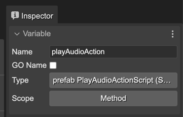
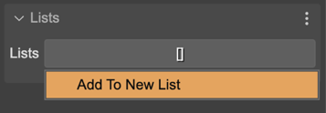
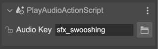

.. include:: ../_header.rst

ScriptNode's properties
~~~~~~~~~~~~~~~~~~~~~~~

The script node objects have no built-in properties. When you select a script node in the scene, the |InspectorView|_ shows a few sections related only to the editor.

It is the case of the `Variable properties <./variable-properties.html>`_. Like the game objects, a script node can be referenced by a variable, and you can set its scope to the method, the class, or declare it as a nested prefab:

A script node also can be added to an `Object List <./object-list.html>`_:

And because it could be created as a prefab instance, it shows the `Prefab Instance properties <./prefab-user-properties-prefab-instance.html>`_:

