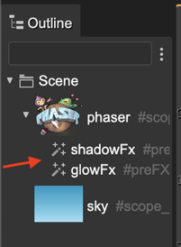

.. include:: ../_header.rst

Adding an effect to a game object
~~~~~~~~~~~~~~~~~~~~~~~~~~~~~~~~~

Every game object has an **FX Shaders** section in the |InspectorView|_:

.. image:: ../images/scene-editor-shader-effects-fx-shader-section-20240212.webp
  :alt: FX Shaders section

It contains the **Add** button that allows you to add a new effect to the game object. When you click the **Add** button, the **Shader Effects** dialog appears:

.. image:: ../images/scene-editor-fx-add-shader-dialog-20240212.webp
  :alt: Add shader FX dialog.

There you can select an FX, and then click the **Add** button to add it to the game object.

Another way to add an effect is to select a game object in the scene, open the context menu and populate the **FX** submenu. It shows the options to add a specific effect:

You can add multiple effects to a game object. They are listed in the |OutlineView|_ just like any other scene object:

You can select an FX object and delete it, copy/paste it, `change its rendering order <working-with-parent-objects.html#changing-the-rendering-order-of-children>`_, or tweak its properties.

The FX object is like any other scene object that you can assign to a variable, or a field, or set as a `nested prefab <prefab-nested.html>`_.