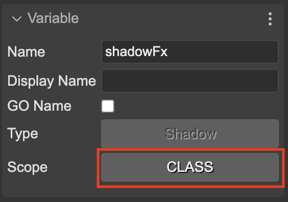

.. include:: ../_header.rst

An effect as a scene object
~~~~~~~~~~~~~~~~~~~~~~~~~~~

An effect is a scene object that you can select in the |OutlineView|_:

.. image:: ../images/scene-editor-shader-effects-outline-20240212.webp
  :alt: Effects in the Outline view.

You can select the FX object and delete it, copy/paste it, `change its rendering order <working-with-parent-objects.html#changing-the-rendering-order-of-children>`_, or tweak its properties.

The `Variable properties <variable-properties.html>`_ are also valid for the FX objects. You can assign the FX to a variable or a field, and use it for implementing custom actions.

Let's say you want to tween the intensity of the shadow FX. You can assign the FX to a field by setting the variable scope to **CLASS**:

Then the |SceneCompiler|_ generates a variable and field for the FX object:

.. code::

    editorCreate() {
        ...
        // shadowFx
        const shadowFx = logo.preFX!.addShadow(0, 0, 0.1, 1, 0, 6, 1);
        ...
        this.shadowFx = shadowFx;
    }

    private shadowFx!: Phaser.FX.Shadow;
    
Then, in the **create** method, you can tween the intensity of the shadow FX:

.. code:: 

    create() {
        ...
        this.add.tween({
            targets: this.shadowFx,
            intensity: 1,
        });
    }

Not only you can assign an FX to a variable, but you can also make a `nested prefab <prefab-nested.html>`_ with it. This way, you can reuse the FX in different scenes.
