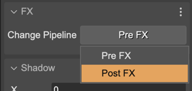

.. include:: ../_header.rst

Effect properties
~~~~~~~~~~~~~~~~~

Every FX type shares a common set of properties. You can edit these properties in the **FX** section. For now, it only contains a button to change the FX to the ``preFX`` or the ``postFX`` pipeline:

