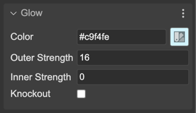

.. include:: ../_header.rst

Glow FX
~~~~~~~

The Glow FX is a simple effect that adds a glow to the edges of the image. It is a post-processing effect that can be applied to any image.

`Learn more about the Phaser.FX.Glow properties in the Phaser documentation <https://newdocs.phaser.io/docs/3.70.0/Phaser.FX.Glow>`_

