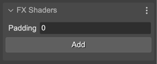

.. include:: ../_header.rst

Game Object properties
~~~~~~~~~~~~~~~~~~~~~~

You can add an FX object to any game object. The **FX Shaders** section in the |InspectorView|_ shows the properties of a game object that are related to the effects.

It contains the **Add** button, to `add a new FX object <shader-effects-add-fx.html>`_.

And contains the **Padding** property, to set the padding to be used by the pre-FX pipeline.

`Learn more about padding in the Phaser documentation <https://newdocs.phaser.io/docs/3.60.0/focus/Phaser.GameObjects.Components.FX-setPadding>`_.