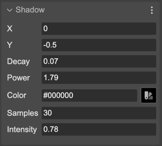

.. include:: ../_header.rst

Shadow FX
~~~~~~~~~

The Shadow FX is a simple and easy-to-use shadowing effect for your images. You can learn more about its properties in the `Phaser.FX.Shadow Phaser documentation <https://newdocs.phaser.io/docs/3.70.0/Phaser.FX.Shadow>`_.

