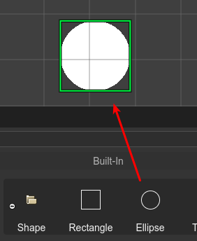
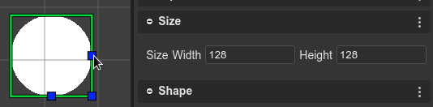

.. include:: ../_header.rst

Ellipse
=======

You can create an `Ellipse <https://photonstorm.github.io/phaser3-docs/Phaser.GameObjects.Ellipse.html>`_ by dropping the **Ellipse** block, from the |BlocksView|_, on the scene.

You can change the size of the Ellipse in the **Size section** or you can use the `Size tool <manipulation-tools.html#resize-tool>`_.

In addition, the Ellipse has the `Smoothness <https://photonstorm.github.io/phaser3-docs/Phaser.GameObjects.Ellipse.html#smoothness__anchor>`_ property (the number of points used when rendering it):

.. image:: ../images/scene-editor-ellipse-3-11092020.webp
    :alt: Ellipse's smoothness property.

The `Ellipse <https://photonstorm.github.io/phaser3-docs/Phaser.GameObjects.Ellipse.html>`_ code is generated by the |SceneCompiler|_ using the `ellipse object factory <https://photonstorm.github.io/phaser3-docs/Phaser.GameObjects.GameObjectFactory.html#ellipse__anchor>`_:

.. code::

    const ellipse = this.add.ellipse(10, 10, 100, 100);
