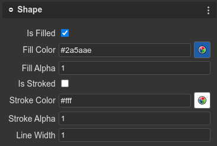

.. include:: ../_header.rst

Shape objects
-------------

.. toctree::

    shape-rectangle-object
    shape-ellipse-object
    shape-triangle-object
    shape-polygon-object

The Shape objects are geometric-based display objects. You can add them to a Scene, a Container or a Group.

All Shape objects extends the `Phaser.GameObjects.Shape <https://photonstorm.github.io/phaser3-docs/Phaser.GameObjects.Shape.html>`_ class and share these common properties:

* `Variable properties <variable-properties.html>`_

* `Lists properties <lists-properties.html>`_

* `Parent properties <parent-container-properties.html>`_

* `Transform properties <transform-properties.html>`_

* `Origin properties <origin-properties.html>`_

* `Size properties <size-properties.html>`_

* `Visible property <visible-property.html>`_

* `Alpha properties <alpha-properties.html>`_

But they have the following properties:

* `Is Filled <https://photonstorm.github.io/phaser3-docs/Phaser.GameObjects.Shape.html#isFilled__anchor>`_: Controls if this Shape is filled or not. Note that some Shapes do not support being filled (such as Line shapes).

* `Fill Color <https://photonstorm.github.io/phaser3-docs/Phaser.GameObjects.Shape.html#fillColor__anchor>`_: The fill color used by this Shape.

* `Fill Alpha <https://photonstorm.github.io/phaser3-docs/Phaser.GameObjects.Shape.html#fillAlpha__anchor>`_: The fill alpha value used by this Shape.

* `Is Stroked <https://photonstorm.github.io/phaser3-docs/Phaser.GameObjects.Shape.html#isStroked__anchor>`_: Controls if this Shape is stroked or not. Note that some Shapes do not support being stroked (such as Iso Box shapes).

* `Stroke Color <https://photonstorm.github.io/phaser3-docs/Phaser.GameObjects.Shape.html#strokeColor__anchor>`_: The stroke color used by this Shape.

* `Stroke Alpha <https://photonstorm.github.io/phaser3-docs/Phaser.GameObjects.Shape.html#strokeAlpha__anchor>`_: The stroke alpha value used by this Shape.

* `Line Width <https://photonstorm.github.io/phaser3-docs/Phaser.GameObjects.Shape.html#lineWidth__anchor>`_: The stroke line width used by this Shape.
