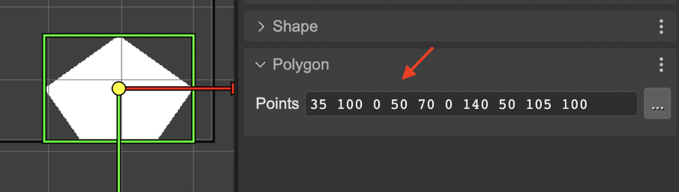

.. include:: ../_header.rst

Polygon
=======

You can create `Polygon <https://photonstorm.github.io/phaser3-docs/Phaser.GameObjects.Polygon.html>`_ object by dropping the **Polygon** block, from the |BlocksView|_, on the scene.

.. image:: ../images/scene-editor-polygon-create-20220623.webp
  :alt: Create a polygon.

A polygon is made with points. You can edit the points in the **Polygon section** or with the `Polygon tool <manipulation-tools.html#polygon-tool>`_.

The Polygon section shows the Points field. The points are presented as a string of the X Y pairs of the points, separated by a space.

The Polygon tool (that you can activate with the `Y` key) shows the polygon's points in the scene. It allows you:

* Change the position of a point: drag the point with the mouse cursor.
* Delete a point: move the mouse cursor over the point and press the `Delete` key. When the cursor is over the point, it is painted in red color.
.. image:: ../images/scene-editor-polygon-edit-points-20220623.webp
  :alt: Move polygon point.
* Add a new point: move the mouse cursor over a line. It shows a white handler under the cursor, you can drag it for creating a new point.
.. image:: ../images/scene-editor-polygon-add-point-20220623.webp
  :alt: Add new point.
.. image:: ../images/scene-editor-polygon-add-point-2-20220623.webp
  :alt: Add new point.

The `Polygon <https://photonstorm.github.io/phaser3-docs/Phaser.GameObjects.Polygon.html>`_ code is generated by the |SceneCompiler|_ using the `polygon object factory <https://photonstorm.github.io/phaser3-docs/Phaser.GameObjects.GameObjectFactory.html#polygon__anchor>`_:

.. code::

    const polygon = this.add.polygon(10, 10, "0 0 20 70 100 100 80 20");
