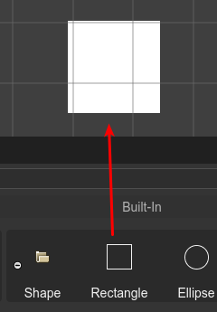
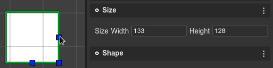

.. include:: ../_header.rst

Rectangle
=========

You can create a `Rectangle <https://photonstorm.github.io/phaser3-docs/Phaser.GameObjects.Rectangle.html>`_ by dropping the **Rectangle** block, from the |BlocksView|_, on the scene.

You can change the size of the Rectangle in the **Size section** or you can use the `Size tool <manipulation-tools.html#resize-tool>`_.

The `Rectangle <https://photonstorm.github.io/phaser3-docs/Phaser.GameObjects.Rectangle.html>`_ code is generated by the |SceneCompiler|_ using the `rectangle object factory <https://photonstorm.github.io/phaser3-docs/Phaser.GameObjects.GameObjectFactory.html#rectangle__anchor>`_:

.. code::

    const rectangle = this.add.rectangle(10, 10, 100, 100);
