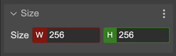

.. include:: ../_header.rst

Size properties
--------------------

The `size properties`_ of the object can be modified in the |InspectorView|_ or by using the `manipulation tools <manipulation-tools.html>`_.

These properties, **Width** and **Height**, are available for game objects like the `TileSprite <tile-sprite-object.html>`_, `Rectangle <shape-object.html#rectangle>`_, `Ellipse <shape-object.html#ellipse>`_, the `NineSlice <nine-slice-object.html>`_, and others.

In addition to writing the values into the property editors, you can use the `Resize manipulator tool <manipulation-tools.html#resize-tool>`_ (``Z``) for changing the size of the object in the scene.