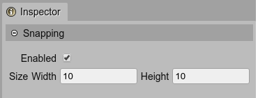
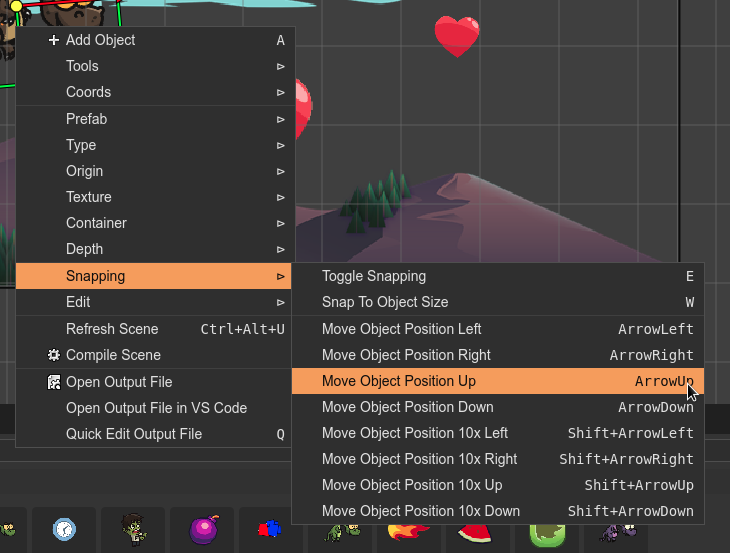

.. include:: ../_header.rst

Snapping properties
~~~~~~~~~~~~~~~~~~~

The snapping properties allow you to divide the scene into a grid and place the objects in the cells of the grid. This is a very useful technique to keep the objects properly aligned.



* **Enabled property**: activates the snapping. You can change the value in the |InspectorView|_ with the ``E`` key.

* **Snapping Width and Height**: is the size of the grid to snap the objects. You can change it in the |InspectorView|_. Also, you can select an object and execute the **Snap To Object Size** command.

Context menu
````````````

The context menu of the scene shows the **Snapping** sub-menu with the snapping commands:

* Toggle Snapping (``E``).

* Snap To Object Size (``W``). This command takes the size of the selected object and sets it as the snapping size values of the scene.

* A couple of commands to move the selected objects position in four directions: left, right, up, down. The commands respects the snapping size. Look there are 10x commands that change the object's position in 10 times.

