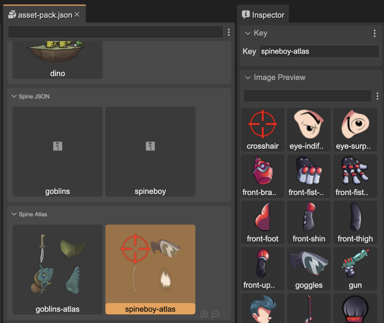
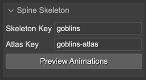
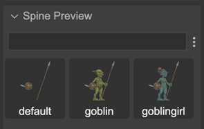
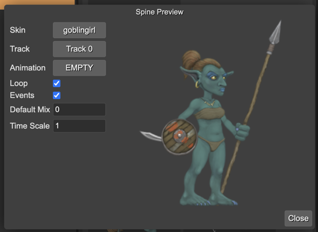
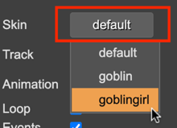
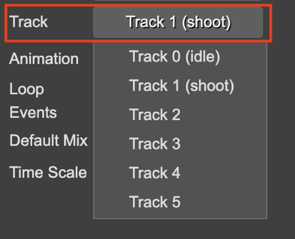
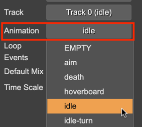
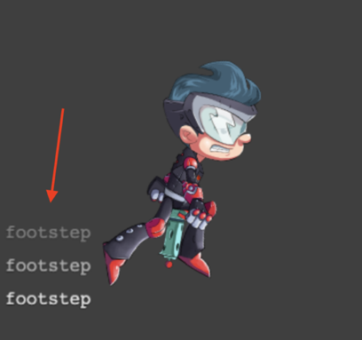

.. include:: ../_header.rst

Spine assets preview
~~~~~~~~~~~~~~~~~~~~

There are different contexts in |PhaserEditor|_ where there are Spine_ assets and you can preview them: in the |AssetPackEditor|_ and the |BlocksView|_ of the |SceneEditor|_.

For displaying and inspecting Spine objects, the |SpinePhaserRuntime|_ requires the skeleton data file and the atlas files. If you follow the default Spine_ assets `naming rules <spine-animations-loading.html#spine-assets-default-naming-rules>`_, then |PhaserEditor|_ can build the skeleton instances and preview them.

In the next sections we explain it in details.

Preview Spine atlas assets
```````````````````````````

The |AssetPackEditor|_ shows the Spine_ atlas assets you add to an |AssetPackFile|_. If you select it in the editor, the |InspectorView|_ shows you all the atlas frames:



Preview Spine skeleton and animation data
``````````````````````````````````````````

You can select a Spine_ skeleton data in the |AssetPackEditor|_ or the |BlocksView|_ of the |SceneEditor|_. In both cases, the |InspectorView|_ shows two sections of properties: the **Spine Skeleton** and the **Spine Preview**.

The **Spine Skeleton** shows the **Skeleton Key** and **Atlas Key**:



The **Spine Preview** section displays the skins defined in the skeleton data:



Preview Spine animations
````````````````````````

Notice the **Spine Skeleton** section contains a **Preview Animations** button. It opens the **Spine Preview** dialog.

In this dialog, you can play the skeleton animations and change other properties like the skin.



Let's go parameter by parameter.

Skin preview
''''''''''''

You can change the preview skin by pressing in the **Skin** button:



Animation and Track
'''''''''''''''''''

With Spine_ you can play simultaneous animations on different tracks. With the **Track** button you can select the track ID for playing the animation you select in the **Animation** button.

In the next image, you can see it is playing the **idle** animation in **Track 0**, and the **shoot** animation in **Track 1**.



When you select an animation in the **Animation** button, it plays it immediately on the selected track:




The animation is played in a loop if the **Loop** parameter is checked.

If the **Events** parameter is checked, then the canvas shows the name of the events the animation emits. Look in this image the **footstep** events:



Also, you can set the **Default Mix** and **Time Scale** of the animation. The **Default Mix** is applied when you change from one animation to another.

`Learn more about applying animations in the Spine Phaser runtime <http://esotericsoftware.com/spine-phaser#Applying-Animations>`_