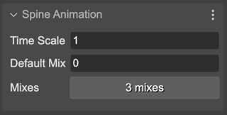
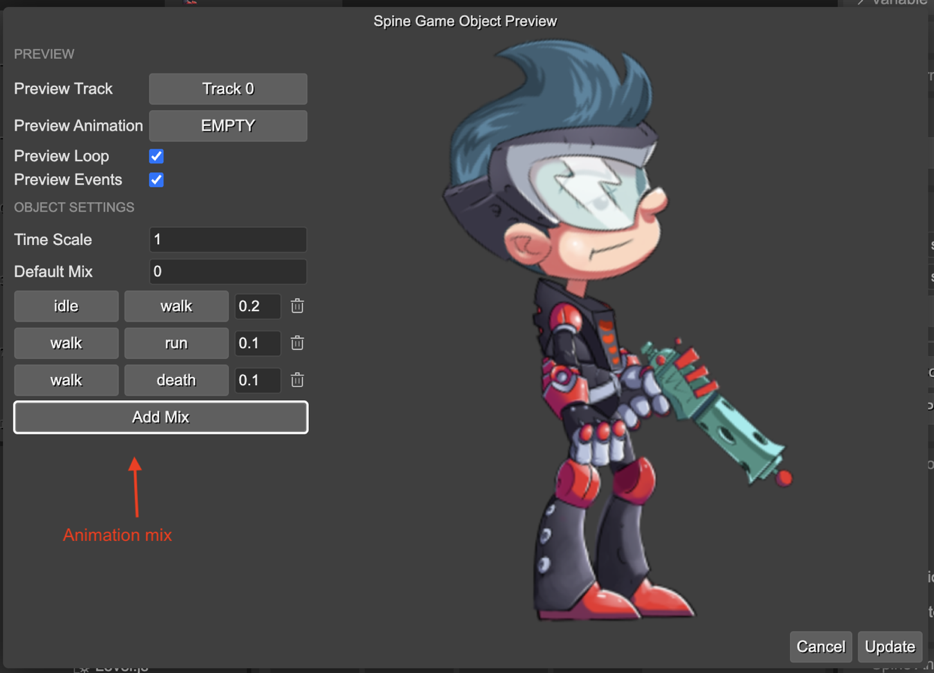

.. include:: ../_header.rst

Animations properties
~~~~~~~~~~~~~~~~~~~~~

The **Spine Animation** section contains the animation properties. 

**Time Scale**: To play the animations and mixes slower or faster. Default ``1``.

**Default Mix**: The mix duration to use when no mix duration is defined in the between two animations.

**Mixes**: The mix duration between two animations.

The **Mixes** button shows the number of defined animation mixes. Click on it to edit the mixes. It opens the `Spine Game Object preview dialog <spine-animations-game-object-properties-preview.html>`_ where you can edit and preview the mixes:

