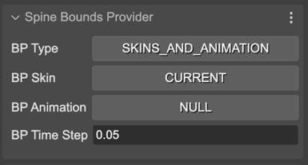
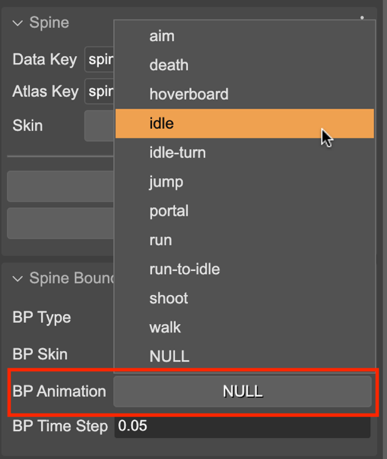

.. include:: ../_header.rst

Bounds provider properties
~~~~~~~~~~~~~~~~~~~~~~~~~~

The bounds provider is the responsible of computing the size of the `SpineGameObject <spine-animations-game-object.html>`_. By default, it uses the setup pose bounding box. There are two built-in implementations of the bounding box: the **SetupPoseBoundsProvider** (default) and the **SkinsAndAnimationBoundsProvider**.

The **Spine Bounds Provider** section in the |InspectorView|_ contains the parameters for setting the bounding box to the game object:



With the **BP Type** you select the bounds provider type: **SETUP_POSE** (``SetupPoseBoundsProvider```) or **SKINS_AND_ANIMATION** (``SkinsAndAnimationBoundsProvider``).

The other parameters are only valid if you select the **SKINS_AND_ANIMATION** bounds provider. This provider uses an animation and an array of skins for computing the bounds.

You can select the skins for the bounds provider in the **BP Skin** parameter. It gives you two options: **CURRENT** (uses the current skin in the game object) or **ALL** (uses all skins available in the game object's skeleton data).

With the **BP Animation** parameter you can select what animation to use for the bounds provider. It lists all the animations available in the skeleton data.



With the **BP Time Step** parameter you can set the precision of the algorithm for computing the bounding size. A smaller time step means more precision, but slower calculation.


