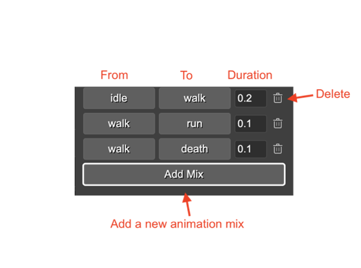

.. include:: ../_header.rst

SpineGameObject preview
```````````````````````

You can preview a `SpineGameObject <spine-animations-game-object.html>`_ by pressing the **Preview** button in the **Spine** section. It opens the a preview dialog where you can select the animation name, the animation track, and other parameters.

This dialog is similar to the `Spine Preview dialog <spine-animations-assets-preview.html#preview-spine-animations>`_, but it also allows edit some properties of the game object, like the default mix, the animation mix, and the time scale:

.. image:: ../images/spine-animations-object-preview-dialog-20230925.webp
  :alt: Spine game object preview dialog

The dialog has two sections: **Preview** and **Settings**. The Preview section has the **Preview Track**, **Preview Animation**, **Preview Loop**, and **Preview Events** parameters. It works just like in the `Spine Preview dialog`_, and it don't affect the object state.

The **Settings** contains the **Time Scale** and **Default Mix** parameters. If you change those parameters and press the **Update** button, then values are set to the game object and persisted in the scene.

In addition, you can set the animation mix values of the game object:



`Learn more about the Spine animation concepts <https://esotericsoftware.com/spine-phaser#Applying-Animations>`_
