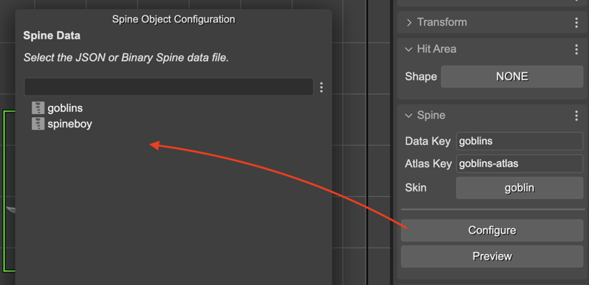
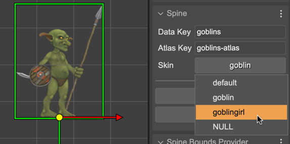

.. include:: ../_header.rst

SpineGameObject properties
~~~~~~~~~~~~~~~~~~~~~~~~~~

.. toctree::
    :maxdepth: 1

    spine-animations-game-object-properties-preview
    spine-animations-game-object-bounds
    spine-animations-game-object-animations

The |InspectorView|_ shows the properties of the `SpineGameObject <spine-animations-game-object.html>`_ instance you select in the scene.

The **Spine** section shows the **Data Key**, **Atlas Key**, and the **Skin** name.

You can change re-configure these values by pressing the **Configure** button. It shows a configuration dialog where you can select skeleton, atlas, and skin:

That's the only way of changing the skeleton and atlas of an object, but you can change the skin straight in the **Skin** parameter:

Below there **Configure** button, there is the **Preview** button. It opens the `Spine Game Object preview <spine-animations-game-object-properties-preview.html>`_ dialog.