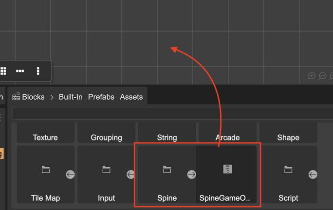
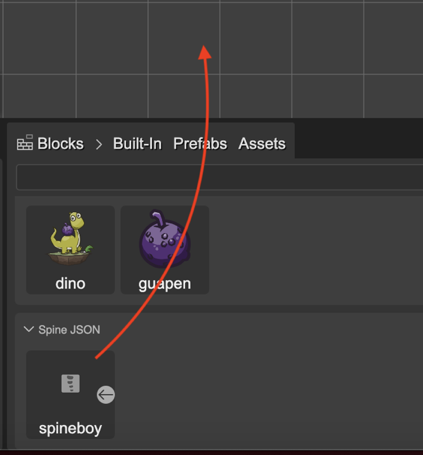
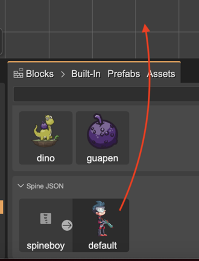

.. include:: ../_header.rst

Creating a SpineGameObject
~~~~~~~~~~~~~~~~~~~~~~~~~~

The `SpineGameObject <https://esotericsoftware.com/spine-phaser#SpineGameObject>`_ is the Phaser_ game object implementation to display, control, and customize Spine_ animations.

The |SpinePhaserRuntime|_ provides the ``spine()`` factory for creating a `SpineGameObject`_. This is an example:

.. code::
 
 const spineObject = this.add.spine(400, 500, "spineboy", "spineboy-atlas");

But you don't need to write that code. The |SceneEditor|_ can generate that code for you. You only need to drag a Spine_ block from the |BlocksView|_ and drop it on the scene.

Let's see the different ways of doing this.

Create a Spine object with a SpineGameObject built-in block
```````````````````````````````````````````````````````````

The main way of adding a `SpineGameObject`_ to the scene is by dropping the **SpineGameObject** block on the scene. This block is located in the **Built-in** section of the |BlocksView|_, under the **Spine** folder. Drag it and drop it on the scene:



It opens a configuration dialog for selecting the skeleton data key and the atlas key to be used by the `SpineGameObject`_. Every `SpineGameObject`_ requires a reference to the skeleton data and the atlas. This means, you first have to `add the skeleton data and atlas files to an Asset Pack file <spine-animations-loading.html>`_. In addition, the |SceneEditor|_ requires that you select the skin of the animation.

This is the workflow:

* Select the skeleton data and press **Next**:

 .. image:: ../images/spine-animations-add-object-data-20230924.webp
   :alt: Select skeleton data.

* Select the atlas and press **Next**:

 .. image:: ../images/spine-animations-add-object-atlas-20230924.webp
   :alt: Select the atlas

* Select the skin and press **Finish**:
 
 .. image:: ../images/spine-animations-add-object-skin-20230924.webp
   :alt: Select the skin.
 
* Finally, it adds the `SpineGameObject`_ to the scene:

 .. image:: ../images/spine-animations-add-obejct-done-20230924.webp
   :alt: Spine game object in the scene.

Create a Spine object with a skeleton data block
`````````````````````````````````````````````````

The **Spine JSON** and **Spine Binary** sections of the |BlocksView|_ show all the skeleton data you `defined in the Asset Pack file <spine-animations-loading.html>`_. You can drag a skeleton data block and drop it on the scene. It shows the configuration dialog to select the atlas and the skin, just like in the previous section. The next image shows the ``spineboy`` skeleton block:



Create a Spine object with a skeleton's skin block
``````````````````````````````````````````````````
If you imported the skeleton data and the atlas assets in the Asset Pack following the `default naming rules <spine-animations-loading.html#spine-assets-default-naming-rules>`_, then the |BlocksView|_ shows a special **skin** block inside the skeleton data block.

Drag this skin block and drop it on the scene. It creates the `SpineGameObject`_ right away, without showing the configuration dialog:

