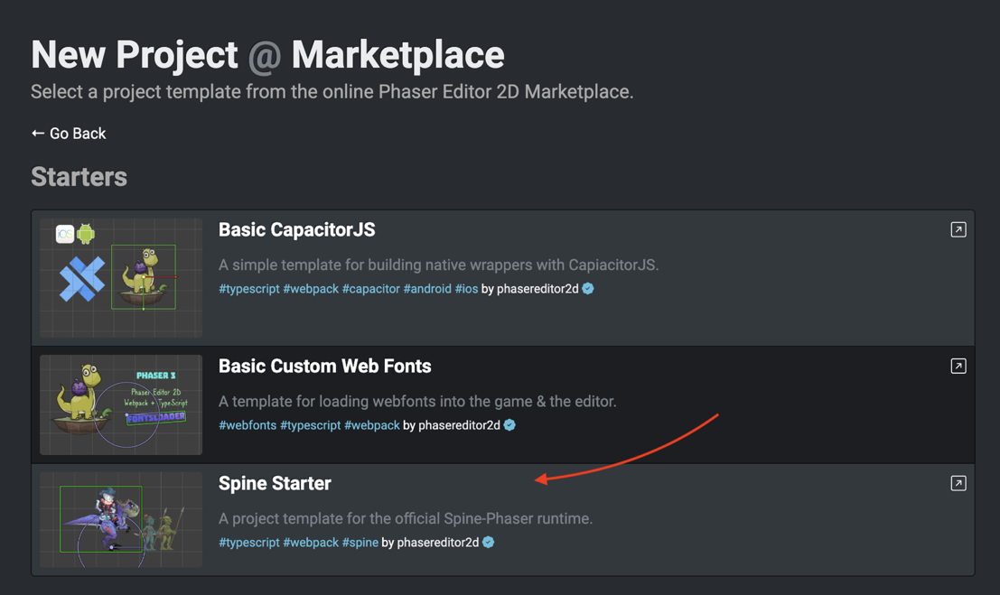

.. include:: ../_header.rst

Installing the Spine plugin in your game
~~~~~~~~~~~~~~~~~~~~~~~~~~~~~~~~~~~~~~~~

The |SpinePhaserRuntime|_ is a third-party library. It is not included in Phaser_ by default.

|PhaserEditor|_ provides the Spine_ tooling by default, you don't need to do any extra steps for using Spine_ in the editor. However, you should install the Spine_ plugin in your game.

You can install it via NPM:

.. highlight:: bash

.. code::

  npm install @esotericsoftware/spine-phaser

Or using the ``script`` tag in the ``index.html`` file of your game:

.. highlight:: html

.. code::
  
  <script src="https://unpkg.com/@esotericsoftware/spine-phaser@4.1.*/dist/iife/spine-phaser.js">
  </script>

Next, add the Spine scene plugin to your Phaser game configuration:

.. highlight:: javascript

.. code::

  const config = {
    ...
    plugins: {
        scene: [{ 
            key: "spine.SpinePlugin",
            plugin: spine.SpinePlugin,
            mapping: "spine" 
          }]
      }
    }

  new Phaser.Game(config);

`Learn more about installing Phaser Spine in your game <https://esotericsoftware.com/spine-phaser#Installation>`_

Spine starter template
``````````````````````
Installing the |SpinePhaserRuntime|_ is not complex, however, we provide a starter template with a basic configuration. If you are going to start a new project, then we recommend you use this project template.

It is available in the `Phaser Editor 2D Marketplace <http://marketplace.phasereditor2d.com/starters/spine/>`_ and in the **Phaser Editor 2D All in One** marketplace page:



