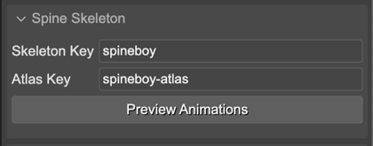
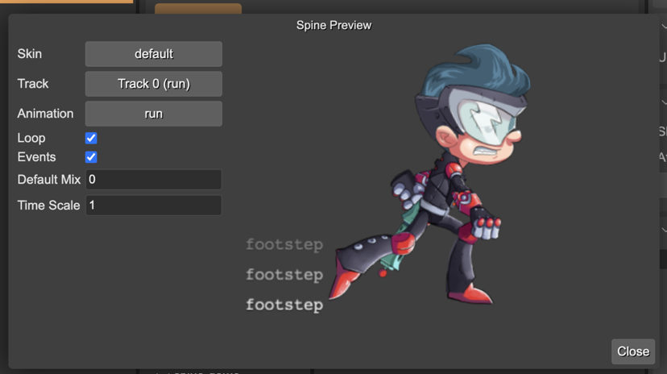
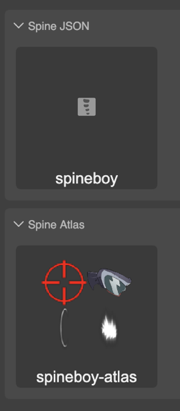

.. include:: ../_header.rst

Loading the Spine assets
~~~~~~~~~~~~~~~~~~~~~~~~

To load a Spine_ animation into a Phaser_ game, you first has to export the animation from the Spine_ editor.

Exporting an animation produces the following assets:

* Skeleton and animation data.
* Texture atlas with the images of the skeleton.

You can export the skeleton and animation data to a JSON file or to a binary file (``.skel``). |PhaserEditor|_ supports both formats. Also, you can export the skeleton images into a texture atlas. It produces a ``.atlas`` file with the frames info and the ``.png`` images.

`Learn more about Assets Management in the Spine editor <https://esotericsoftware.com/spine-phaser#Asset-Management>`_

The common way to import the Spine_ assets into a Phaser_ game is using the Phaser_ loader methods:

* ``spineBinary(key, url)`` - Loads ``.skel`` files containing skeleton and animation data.
* ``spineJson(key, url)`` - Loads the ``.json`` files containing skeleton and animation data.
* ``spineAtlas(key, url, premultipliedAlpha)`` - Loads the texture atlas files.

This is an example:

.. code::

    preload() {
        this.load.spineBinary("skeleton", "path/to/skeleton.skel");
        this.load.spineAtlas("skeleton-atlas", "path/to/skeleton.atlas");
    }

However, |PhaserEditor|_ provides the |AssetPackEditor|_, which is a visual tool for loading the assets into the Phaser_ games.

The workflow for importing the Spine_ assets into the an Asset Pack file is:

* Export the assets from the Spine_ editor into the "assets" folder of the game project:
  
  .. image:: ../images/spine-animations-assets-20230923.webp
    :alt: Copy Spine files into the assets folder of your game.

* In the |Filesview|_, select the data ``.json`` file (or ``.skel`` if it is exported with the binary format):
  
  .. image:: ../images/spine-animations-select-data-file-20230923.webp
    :alt: Select data file in the Files view

* In the |InspectorView|_, the **Asset Pack Entry** section shows a button for importing the selected file into an Asset Pack file:
  

  .. image:: ../images/spine-animations-import-data-file-20230923.webp
    :alt: Import the file into an asset pack.
* Do the same process but with the ``.atlas`` file. Select it in the |FilesView|_ and add it to an asset pack:
  
  .. image:: ../images/spine-animations-select-atlas-file-20230923.webp
    :alt: Select the atlas file.

  .. image:: ../images/spine-animations-add-atlas-to-pack-20230923.webp
    :alt: Add the atlas file to the asset pack.

* Open the ``asset-pack.json`` file in the |AssetPackEditor|_ and check the Spine assets are there:
  
  .. image:: ../images/spine-animations-asset-pack-20230923.webp
    :alt: The spine assets in the Asset Pack editor.

If everything is well, you will find both the data file and the atlas file in the pack editor. If you select the data file entry, the |InspectorView|_ shows the info and the animation preview. You can click on the **Preview Animations** button. It opens a dialog where you can play the animations. We talk more about this dialog later.

**Important!** The |SpinePhaserRuntime|_ allows using different atlas for the same skeleton. For previewing a skeleton, the editor looks for an atlas asset with the same key but with the ``-atlas`` suffix. In the above example, the skeleton data has the ``spineboy`` key, and the atlas asset the ``spineboy-atlas`` key:

