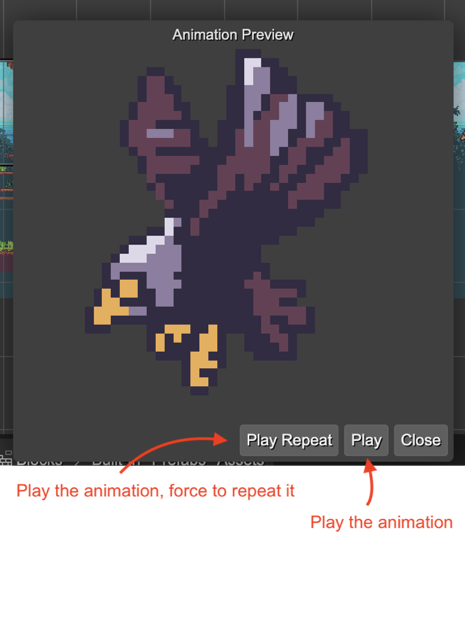

.. include:: ../_header.rst

Sprite animation preview
~~~~~~~~~~~~~~~~~~~~~~~~

|PhaserEditor|_ provides a dialog for previewing the sprite animations:

You can open this dialog in different contexts:

* In the |AssetPackEditor|_, when you select a Sprite animation in the Outline view:
    
    .. image:: ../images/aseprite-preview-asset-pack-20231102.webp
      :alt: Preview in the Asset Pack editor.

* In the Blocks view of the |SceneEditor|_, as a Sprite animation block:

    .. image:: ../images/scene-editor-aseprite-animation-block-preview-1-20231102.webp
      :alt: Animation block.

    .. image:: ../images/scene-editor-aseprite-animation-block-preview-2-20231102.webp
      :alt: Animation block properties.

* In the `Animation properties section <../scene-editor/animations-properties.html>`_, when selecting a Sprite game object in the |SceneEditor|_:

   .. image:: ../images/scene-editor-sprite-animation-preview-inspector-20231102.webp
      :alt: Animation properties.