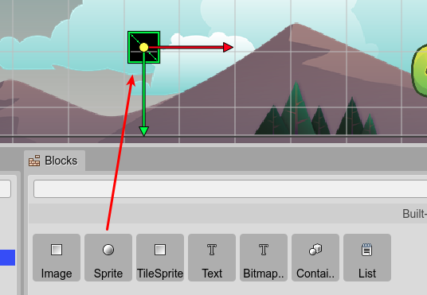

.. include:: ../_header.rst

Sprite objects
--------------

The `Sprite <sprite-object.html>`_ is a built-in Phaser_ object type: `Phaser.GameObjects.Sprite <https://photonstorm.github.io/phaser3-docs/Phaser.GameObjects.Sprite.html>`_. It is like the `Image <image-object.html>`_ type, but also it can play `sprite animations <https://photonstorm.github.io/phaser3-docs/Phaser.GameObjects.Sprite.html#play__anchor>`_. This means, that you may use a `Sprite`_ object only if it will be animated in the game, otherwise, the better is to use an `Image`_.

A `Sprite`_ is created in code using the `sprite factory <https://photonstorm.github.io/phaser3-docs/Phaser.GameObjects.GameObjectFactory.html#sprite__anchor>`_. This is how the |SceneCompiler|_ generates the code of a `Sprite`_:

.. code::

  const player = this.add.sprite(192, 512, "dragon-atlas", "idle-000");

To create a `Sprite`_ object, you can drop a `Sprite built-in block <blocks-view-integration.html>`_ on the scene. Or you can convert an `Image`_ or `TileSprite <tile-sprite-object.html>`_ into a `Sprite`_.

`Learn more about type conversion <replace-object-type.html>`_

The `Sprite`_ type has properties common to other object types:

* `Variable properties <variable-properties.html>`_

* `Lists properties <lists-properties.html>`_

* `Parent properties <parent-container-properties.html>`_

* `Transform properties <transform-properties.html>`_

* `Origin properties <origin-properties.html>`_

* `Flip properties <flip-properties.html>`_

* `Visible property <visible-property.html>`_

* `Alpha properties <alpha-properties.html>`_

* `Texture property <texture-property.html>`_