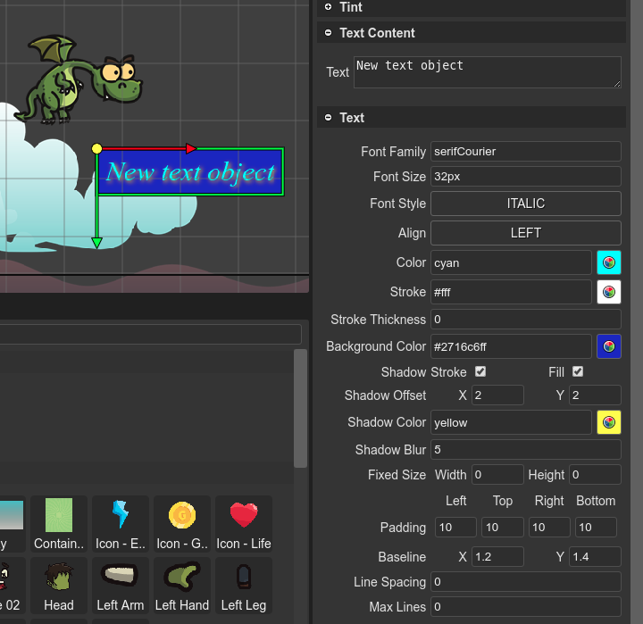

.. include:: ../_header.rst

Text objects
------------

The `Text type <https://photonstorm.github.io/phaser3-docs/Phaser.GameObjects.Text.html>`_ allows to create `Text objects`_ based on HTML fonts. It allows customizing the color of the text, the shadows, the stroke, etc... 

You can create a `Text object <text-object.html>`_ using the `Add Object dialog <add-object-dialog.html>`_. Also, using the `type replacing dialog <replace-object-type.html>`_, you can convert a `Bitmap Text <bitmap-text-object.html>`_ (or any other object) into a `Text object`_.

The `Text <text-object.html>`_ objects are created in code using the `text factory <https://photonstorm.github.io/phaser3-docs/Phaser.GameObjects.GameObjectFactory.html#text__anchor>`_. This is how the `scene compiler <scene-compiler.html>`_ generates that code:

.. code::

    const text_1 = this.add.text(90, 385, "", {});
    text_1.text = "New Text object";
    text_1.setStyle({
        "backgroundColor":"blue",
        "color":"orange",
        "fontFamily":"serif",
        "fontSize":"60px",
        "fontStyle":"bold italic",
        "stroke":"orange",
        "shadow.offsetX":5,
        "shadow.offsetY":5,
        "shadow.color":"brown",
        "shadow.blur":7,
        "shadow.stroke":true,
        "shadow.fill":true});
    text_1.setPadding({"left":10,"top":10,"right":10,"bottom":10});

Text type properties
~~~~~~~~~~~~~~~~~~~~

The `Text type`_ contains many of the `common object properties <common-object-properties.html>`_:

* `Variable properties <variable-properties.html>`_

* `Lists properties <lists-properties.html>`_

* `Parent Container properties <parent-container-properties.html>`_

* `Transform properties <transform-properties.html>`_

* `Origin properties <origin-properties.html>`_

* `Flip properties <flip-properties.html>`_

* `Visible property <visible-property.html>`_

* `Alpha properties <alpha-properties.html>`_

It also contains the `Text property <text-property.html>`_, that is dedicated to all the objects with texts, and its specific properties:

* The `TextStyle <https://photonstorm.github.io/phaser3-docs/Phaser.Types.GameObjects.Text.html#.TextStyle>`_ properties.

* The `TextShadow <https://photonstorm.github.io/phaser3-docs/Phaser.Types.GameObjects.Text.html#.TextShadow>`_ properties.

* The `TextPadding <https://photonstorm.github.io/phaser3-docs/Phaser.Types.GameObjects.Text.html#.TextPadding>`_ properties.

In the |InspectorView|_, hover the mouse in the label of each property to get a tooltip with the |PhaserAPI|_.

