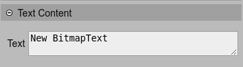

.. include:: ../_header.rst

Text property
-------------

There are a couple of object types in Phaser_ dedicated to display a text. The |SceneEditor|_, for now, supports the `BitmapText <bitmap-text-object.html>`_ and `Text <text-object.html>`_ types.

The `text property`_ can be edited in the **Text Content** section of the |InspectorView|_.

