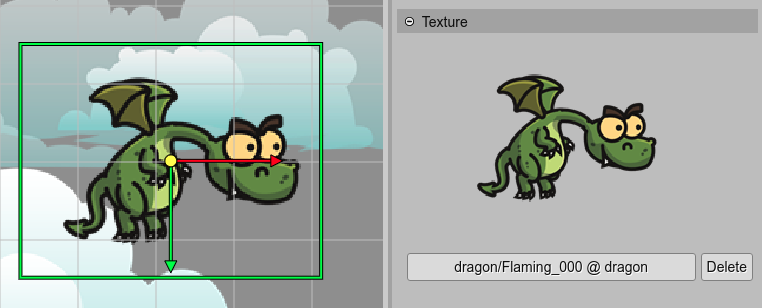
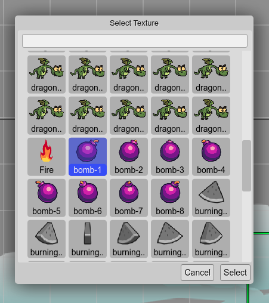
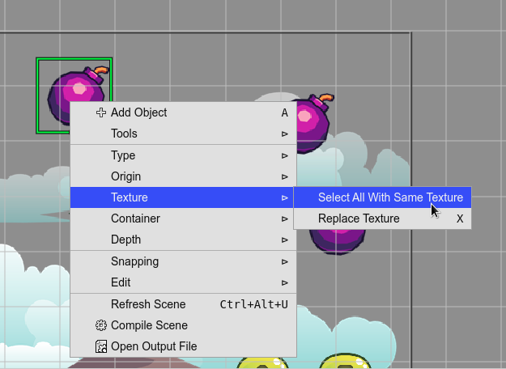

.. include:: ../_header.rst

Texture property
----------------

The |SceneEditor|_ supports a couple of object types with texture:

* `Image <image-object.html>`_

* `Sprite <sprite-object.html>`_

* `Tile Sprite <tile-sprite-object.html>`_

The |SceneEditor|_ provides an |InspectorView|_ section to set the texture of an object:

It shows a button with the key of the image in the |AssetPackFile|_. If the texture is taken from a texture map or sprite-sheet, then it shows that key too.

To change the texture of the object, click on the button, it will open the **Texture dialog**. This dialog shows all the textures available in the |AssetPackFile|_, and you can select the new texture for the object.

You can open the dialog with the **Replace Texture** command. This command can be executed by pressing the ``X`` key, selecting it in the context menu or the `Command Palette <../workbench/command-palette.html>`_.

The context menu also shows the **Select All With Same Texture** command. This command selects all the objects with a texture equals to the texture of the selected object. This command can help you to replace an old texture with a new texture of all the objects of a scene.

