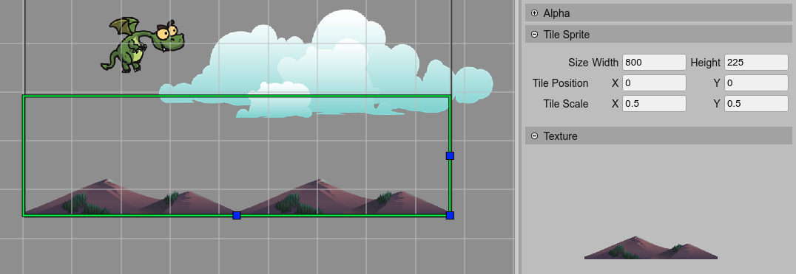

.. include:: ../_header.rst

Tile Sprite objects
-------------------

The `Tile Sprite <tile-sprite-object.html>`_ is a built-in Phaser_ object type: `Phaser.GameObjects.TileSprite <https://photonstorm.github.io/phaser3-docs/Phaser.GameObjects.TileSprite.html>`_. This type allows creating objects with repeating textures, like background elements.

A `Tile Sprite`_ is created in code using the `tileSprite factory <https://photonstorm.github.io/phaser3-docs/Phaser.GameObjects.GameObjectFactory.html#tileSprite__anchor>`_. This is how the |SceneCompiler|_ generates the code of a `Tile Sprite`_:

.. code::

  // x = 0, y = 600, width = 600, height = 800, texture = "rocks_1"
  const rocks = this.add.tileSprite(0, 600, 800, 225, "rocks_1");

To create a `Tile Sprite`_ object in the scene, you can use the `Add Object dialog <add-object-dialog.html>`_ or `convert an Image or Sprite into a Tile Sprite <replace-object-type.html>`_.

Tile Sprite properties
~~~~~~~~~~~~~~~~~~~~~~

The `Tile Sprite`_ type shares properties with other object types:

* `Variable properties <variable-properties.html>`_

* `Lists properties <lists-properties.html>`_

* `Parent Container properties <parent-container-properties.html>`_

* `Transform properties <transform-properties.html>`_

* `Origin properties <origin-properties.html>`_

* `Flip properties <flip-properties.html>`_

* `Visible property <visible-property.html>`_

* `Alpha properties <alpha-properties.html>`_

* `Texture property <texture-property.html>`_

But also it has particular properties:

* The `width <https://photonstorm.github.io/phaser3-docs/Phaser.GameObjects.TileSprite.html#width__anchor>`_ and `height <https://photonstorm.github.io/phaser3-docs/Phaser.GameObjects.TileSprite.html#height__anchor>`_ size properties. If the size of the object is bigger than the original texture, then the object is rendered repeating the texture. You can change these properties in the |InspectorView|_ or using the `Resize Tile Sprite manipulator tool <manipulation-tools.html#resize-tile-sprite-tool>`_: press the ``Z`` key or select **Tools** |-| **Resize Tile Sprite Tool** in the context menu.

* The `tilePositionX <https://photonstorm.github.io/phaser3-docs/Phaser.GameObjects.TileSprite.html#tilePositionX__anchor>`_ and `tilePositionY <https://photonstorm.github.io/phaser3-docs/Phaser.GameObjects.TileSprite.html#tilePositionY__anchor>`_ properties. It changes the offset of the original texture rendering. You can modify it in the |InspectorView|_.

* The `tileScaleX <https://photonstorm.github.io/phaser3-docs/Phaser.GameObjects.TileSprite.html#tileScaleX__anchor>`_ and `tileScaleY <https://photonstorm.github.io/phaser3-docs/Phaser.GameObjects.TileSprite.html#tileScaleY__anchor>`_ properties. It changes the scale of the original texture rendering (not the scale of the object). You can modify it in the |InspectorView|_.
