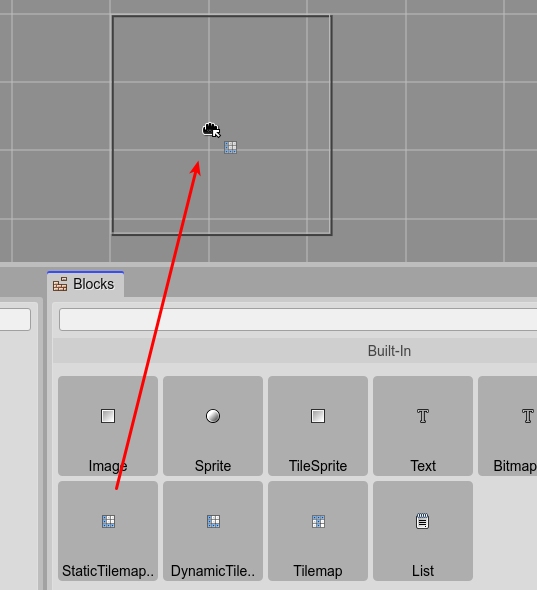
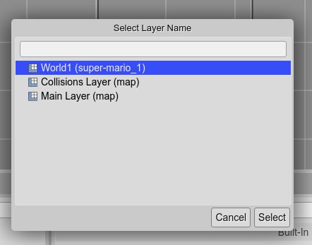
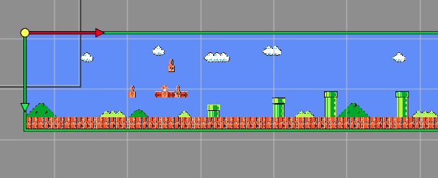
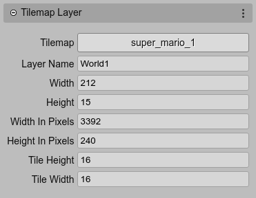

.. include:: ../_header.rst

Tilemap Layer objects
---------------------

A **Tilemap Layer** is a display object that shows a map based on tiles. There are two Phaser_ built-in types dedicated to this, the `StaticTilemapLayer <https://photonstorm.github.io/phaser3-docs/Phaser.Tilemaps.StaticTilemapLayer.html>`_ and the the `DynamicTilemapLayer <https://photonstorm.github.io/phaser3-docs/Phaser.Tilemaps.StaticTilemapLayer.html>`_.

The main difference is that a static layer is read-only but faster, while you can modify the tiles of a dynamic layer.

To create a tilemap layer, first, you have to `create a Tilemap object <tilemap-object.html>`_. Then, you can drag the **StaticTilemapLayer** or **DynamicTilemapLayer** from the `Blocks view <blocks-view-integration.html>`_ and drop it in the scene:

The |SceneEditor|_ does not support empty tilemap layers, and you have to select one of the layers defined in any of the tilemaps created in the scene:

And that's all, the tilemap layer is displayed in the scene:

When you save the scene, the |SceneCompiler|_ generates the code of the tilemap layer using the `createStaticLayer <https://photonstorm.github.io/phaser3-docs/Phaser.Tilemaps.Tilemap.html#createStaticLayer__anchor>`_ or `createDynamicLayer <https://photonstorm.github.io/phaser3-docs/Phaser.Tilemaps.Tilemap.html#createDynamicLayer__anchor>`_ methods.

In the next code, a new static layer is created, using the the ``World1`` layer data and the ``SuperMarioBros-World1-1`` tileset:

.. code::

    // world1
    super_mario_1.createStaticLayer("World1", ["SuperMarioBros-World1-1"], 107, 110);

A layer may use only a subset of the tilesets defined in a tilemap. The compiler scans all the layer's tiles and uses as argument only the name of the tilesets referenced in the tiles.

A tilemap layer has a lot of utility methods and properties, so probably you may want to assign it to a field by setting its `variable scope <variable-properties.html#scope-property>`_ to ``Class``.

When you select a tilemap layer, the |InspectorView|_ shows some of the properties of the layer (all of them are read-only):

Also, because it is a display object, other common properties are available:

* `Variable properties <variable-properties.html>`_

* `Lists properties <lists-properties.html>`_

* `Transform properties <transform-properties.html>`_

* `Visible property <visible-property.html>`_