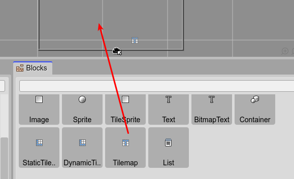
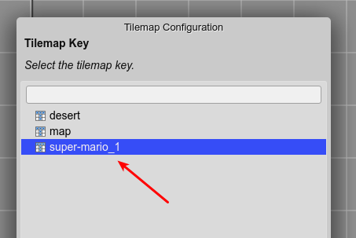
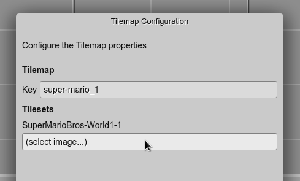
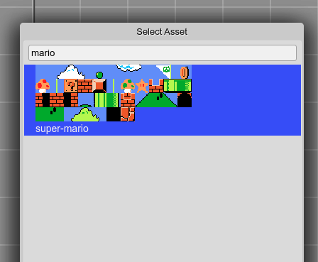
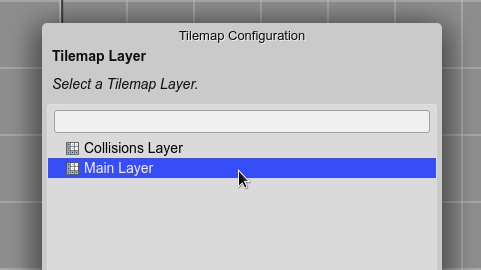
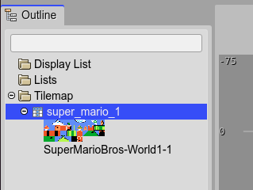
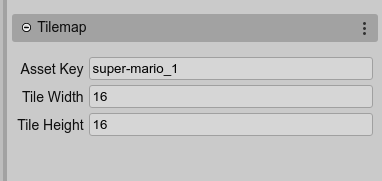
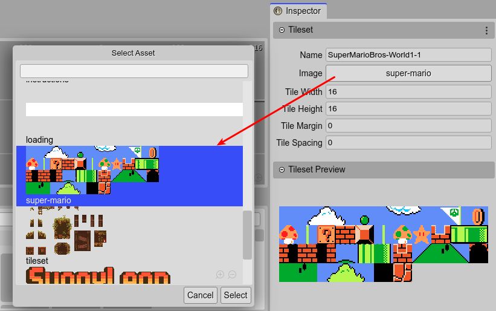

.. include:: ../_header.rst

Tilemap objects
---------------

The `Tilemap <tilemap-object.html>`_ is a built-in Phaser_ type: `Phaser.Tilemaps.Tilemap <https://photonstorm.github.io/phaser3-docs/Phaser.Tilemaps.Tilemap.html>`_. It is not a display object, it just stores the data of the maps. The display maps are added to the scene using `TilemapLayer objects <tilemap-layer-object.html>`_.

The |SceneEditor|_ only supports maps created by Tiled_ (the popular third-party tool) with the `JSON format <https://doc.mapeditor.org/en/stable/manual/export/#json>`_.

This is the workflow:

* Create a map with Tiled_.
* Export the map using the JSON format.
* Import the map (and the tileset images) into |PhaserEditor|_ using the |AssetPackEditor|_.
* Create a `Tilemap <tilemap-object.html>`_ object (and `TilemapLayer objects`_) in the |SceneEditor|_.

To create a `Tilemap <tilemap-object.html>`_ object, you can drag the **Tilemap** element from the `Blocks view <blocks-view-integration.html>`_ and drop it into the scene:

pepe

Immediately, it shows a wizard to configure the Tilemap. This wizard shows three pages:

* A page to select the tilemap key (defined in the |AssetPackEditor|_).
* A page to assign the images to the tilesets of the tilemap.
* A page to select a tilemap layer to be created together with the tilemap. But this one is optional.

The first step is to select the **Tilemap Key**. It is the same key you used to import the Tiled_ JSON map in the |AssetPackEditor|_:

Then, the wizard shows the name of the tilesets, and you have to select the image for each tileset. Select a tileset and click on the **Set Tileset Image** button. It opens a dialog with all the images (and sprite-sheets) defined in the Asset Pack files. Also, you can double lick on the tileset name to open the dialog:

.. image:: ../images/scene-editor-add-tilemap-3.1-10152020.webp
    :alt: Select the tileset image.

When all the tileset images are set, the **Finish** button is enabled. Click on it to finish the process. Or you can continue to the next page to select a Tilemap Layer. In that case, new Tilemap and Tilemap Layer are created.

Because a `Tilemap <tilemap-object.html>`_ is not a display object, it is not shown in the scene, else in the |OutlineView|_, together with the tilesets:

When you select a `Tilemap <tilemap-object.html>`_, the |InspectorView|_ shows some of its properties:

Also, if you select the tileset the |InspectorView|_ show its properties and the option to change the associated image:

`Tilemap <tilemap-object.html>`_ objects are code-generated by the |SceneCompiler|_ using the `tilemap <https://photonstorm.github.io/phaser3-docs/Phaser.GameObjects.GameObjectFactory.html#tilemap__anchor>`_ factory . And the tileset images are created using the `Tilemap.addTilesetImage <https://photonstorm.github.io/phaser3-docs/Phaser.Tilemaps.Tilemap.html#addTilesetImage__anchor>`_ method:

.. code::

    // super_mario_1
    const super_mario_1 = this.add.tilemap("super-mario_1");
    super_mario_1.addTilesetImage("SuperMarioBros-World1-1", "super-mario");

By default, a `Tilemap <tilemap-object.html>`_ is created with a `Class-scope <variable-properties.html#scope-property>`_. It means, a field code is generated to reference the object, so you can manually configure other aspects of the map or manually create the layers:

.. code::

    this.super_mario_1 = super_mario_1;

However, for creating the layers, you have the `TilemapLayer objects`_ support in the |SceneEditor|_, which is explained in the next section.