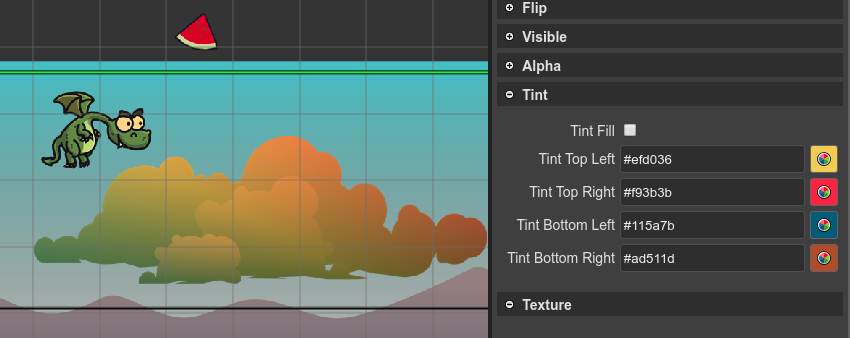

.. include:: ../_header.rst

Tint properties
---------------

The `tint properties <https://photonstorm.github.io/phaser3-docs/Phaser.GameObjects.Components.Tint.html#tintTopLeft__anchor>`_ of the object are shown in the **Tint** section of the |InspectorView|_:

By default, the `tint properties`_ have a default value of ``#FFFFFF``. To reset it to the default value you can delete it in the text field. You can write any CSS valid color format (``#ff0000``, ``red``, ``rgb(255, 0, 0)``).
At code generation, the value is converted to an integer, as the `tint properties`_ requires.
