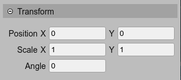

.. include:: ../_header.rst

Transform properties
--------------------

The `transform properties`_ of the object can be modified in the |InspectorView|_ or by using the `manipulation tools <manipulation-tools.html>`_.

* The `X <https://photonstorm.github.io/phaser3-docs/Phaser.GameObjects.Components.Transform.html#x__anchor>`_ and `Y <https://photonstorm.github.io/phaser3-docs/Phaser.GameObjects.Components.Transform.html#x__anchor>`_ of the position. See the `position manipulation tool <manipulation-tools.html#translate-tool>`_.

* The `scaleX <https://photonstorm.github.io/phaser3-docs/Phaser.GameObjects.Components.Transform.html#scaleX__anchor>`_ and `scaleY <https://photonstorm.github.io/phaser3-docs/Phaser.GameObjects.Components.Transform.html#scaleY__anchor>`_. The default value is ``1``. See the `scale manipulation tool <manipulation-tools.html#scale-tool>`_.

* The `angle <https://photonstorm.github.io/phaser3-docs/Phaser.GameObjects.Components.Transform.html#angle__anchor>`_, in degrees. The default values is ``0``. See the `rotate manipulation tool <manipulation-tools.html#rotate-tool>`_.