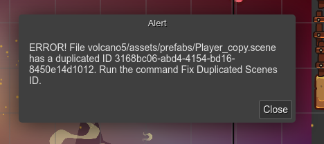

.. include:: ../_header.rst

Troubleshooting
---------------

This is a chapter dedicated to common mistakes or issues you can find using the |SceneEditor|_.

Scene dependencies model
````````````````````````

The |SceneEditor|_ is a complex tool. It depends on the state of the whole project. A change in an asset file, a |AssetPackFile|_ or a prefab_ file, can affect to the |SceneEditor|_ content. For that reason, you may find a glitch or something weird in the editor, like an object without an image or an object with an out-dated image. In this case, you can do any other following steps:

* Execute the **Refresh Scene** command: press ``Ctrl+Alt+U`` or find it in the context menu.

* Reload the project assets: press ``Ctrl+Alt+R`` or click on the **Reload Project** option in the |MainMenu|_.

Outdated generated code
``````````````````````
It is possible that when you execute the game, the scene you see is different. A possible cause could be that the scene was not re-compiled after a prefab_ file change.

If you change a prefab_ file, for example, you change the type of the `prefab object <../scene-editor/prefab-object.html>`_, then you should re-compile all the scenes referencing that prefab_ file. The quick solution is to re-compile the whole project: press ``Ctrl+Alt+B`` or select the **Compile Project** option in the |MainMenu|_.

Duplicated scene identifier
```````````````````````````

Each scene file has an identifier that should be unique in the project. When you create a new scene file, a new identifier is generated for it. However, if you copy the content of a scene file and create a new file with it, then you will get different files with the same identifier.

If it is the case, the editor will show an error message with the files with the same identifier:



You must fix that error because it could create unexpected behaviors.

To fix it, open the |CommandPalette|_ (``Ctrl+K``) and run the **Fix Duplicated Scenes ID** command.

This command will generate a new identifier for all the scene files that share the same identifier. Only the original file is not modified, in this case, the file with the older modification time.

We recommend to use the **Fix Duplicated Scenes ID** command, but you can modify the scene identifier manually. Just open the file in a text editor and change the ``id`` field.

.. code::

    {
        id: "write-here-a-unique-identifier",
        // ...
    }

The |SceneEditor|_ uses the ``Phaser.Utils.String.UUID()`` function to generate a new identifier. You can do the same.