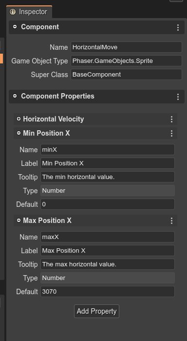
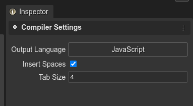

.. include:: ../_header.rst

The User Components compiler
````````````````````````````

The |UserComponents|_ are configured in ``*.components`` files and used by the |SceneEditor|_. It is a concept of |PhaserEditor|_, not Phaser_. So we use the same |SceneEditor|_ philosophy, it compiles our custom configurations into plain, readable, fully Phaser_ compatible code.

Following, look at how an **HorizontalMove** component is compiled into JavaScript.

The component information:



The generated code:

.. code::

    // You can write more code here

    /* START OF COMPILED CODE */

    class HorizontalMove extends BaseComponent {
        
        constructor(gameObject) {
            gameObject["__HorizontalMove"] = this;
            
            /** @type {Phaser.GameObjects.Image} */
            this.gameObject = gameObject;
            /** @type {number} */
            this.horizVelocity = 0;
            /** @type {number} */
            this.minX = 0;
            /** @type {number} */
            this.maxX = 3070;
            
            /* START-USER-CTR-CODE */
            // Write your code here.
            /* END-USER-CTR-CODE */
        }
        
        /** @returns {HorizontalMove} */
        static getComponent(gameObject) {
            return gameObject["__HorizontalMove"];
        }
        
        /* START-USER-CODE */
        // Write your code here.
        /* END-USER-CODE */
    }

    /* END OF COMPILED CODE */
    // You can write more code here


The generated class is very simple, next we explain it part by part:

.. topic:: The super class

If a value (in this case ``BaseComponent``) is set to the **Super Class** parameter. Then the class code is generated like this:

.. code::

    class HorizontalMove extends BaseComponent {
        ...
    }

A super class allows to create behaviors that are common to certain components, or provide helper methods. It is the case of the ``EventComponent`` class, explained in the `Starting and updating the User Components <user-components-start-update-methods.html>`_ section.

.. warning::
    
    A common error when extending components is to load the script files in the |AssetPackEditor|_, using the **Script** file type. It can cause a "missing class" error at the execution of the game. The problem is that the scripts files are loaded and executed in any order. The solution is to add the scripts using the **Scripts** file type of the |AssetPackEditor|_. It allows setting the execution order of the scripts: the super class script ``EventComponent.js`` should be executed before the component script ``HorizontalMove.js``.

    `Learn more about the execution order of the scripts <../asset-pack-editor/import-scripts.html#execution-order-of-the-scripts>`_

.. topic:: The constructor
    
    The component has a constructor where all properties are initialized and you can add your initialization code too.

    .. image:: ../images/scene-editor-user-components-ctr-code-07292020.webp
        :alt: The constructor code.

    The constructor is used to create the component and add it to the game object:

    .. code::

        const enemy = this.add.image(...);
        const enemyMove = new HorizontalMove(enemyMove);
        enemyMove.maxX = 400;

.. topic:: The component accessor method

    The ``getComponent()`` method gets the component from a game object, if exists:

    .. code::
        
        class HorizontalMove {
            
            ...

            /** @returns {HorizontalMove} */
            static getComponent(gameObject) {
                return gameObject["__HorizontalMove"];
            }
        }

        // in a random part of the game
        const enemy = ...;
        const horizMove = HorizontalMove.getComponent(enemy);
        horizMove.minX = 10;


.. topic:: The user members of the component

    You can add members to the component class. Just write them inside the ``/* STAR-USER-CODE */`` and ``/* END-USER-CODE */`` comments.

    Probably, you would like to write a **start** and **update** method, like is explained in the `Starting and updating components <user-components-start-update-methods.html>`_ section.

Compiler settings
'''''''''''''''''

The User Components compiler supports two JavaScript and TypeScript as output languages. You can select this language in the |InspectorView|_, when no component is selected. Also, you can select if insert spaces for indentation and the tab size:



The settings have default values, but if there are other scene files or user components files, the default values will be taken from the latest modified file (scene file if not components files are available).