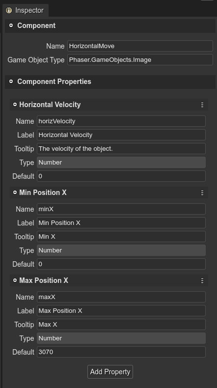
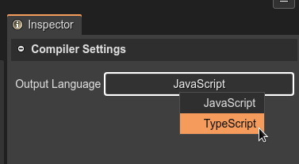

.. include:: ../_header.rst

The User Components compiler
````````````````````````````

The |UserComponents|_ are configured in ``*.components`` files and used by the |SceneEditor|_. It is a concept of |PhaserEditor|_, not Phaser_. So we use the same |SceneEditor|_ philosophy, it compiles our custom configurations into plain, readable, fully Phaser_ compatible code.

Following, look at how an **HorizontalMove** component is compiled into JavaScript.

The component information:



The generated code:

.. code::

    // You can write more code here

    /* START OF COMPILED CODE */

    class HorizontalMove {
        
        constructor(gameObject) {
            gameObject["__HorizontalMove"] = this;
            
            /** @type {Phaser.GameObjects.Image} */
            this.gameObject = gameObject;
            /** @type {number} */
            this.horizVelocity = 0;
            /** @type {number} */
            this.minX = 0;
            /** @type {number} */
            this.maxX = 3070;
            
            /* START-USER-CTR-CODE */
            // Write your code here.
            /* END-USER-CTR-CODE */
        }
        
        /** @returns {HorizontalMove} */
        static getComponent(gameObject) {
            return gameObject["__HorizontalMove"];
        }
        
        /* START-USER-CODE */
        // Write your code here.
        /* END-USER-CODE */
    }

    /* END OF COMPILED CODE */
    // You can write more code here


The generated class is very simple, next we explain it part by part:

.. topic:: The constructor
    
    The component has a constructor where all properties are initialized and you can add your initialization code too.

    .. image:: ../images/scene-editor-user-components-ctr-code-07292020.webp
        :alt: The constructor code.

    The constructor is used to create the component and add it to the game object:

    .. code::

        const enemy = this.add.image(...);
        const enemyMove = new HorizontalMove(enemyMove);
        enemyMove.maxX = 400;

.. topic:: The component accessor method

    The ``getComponent()`` method gets the component from a game object, if exists:

    .. code::
        
        class HorizontalMove {
            
            ...

            /** @returns {HorizontalMove} */
            static getComponent(gameObject) {
                return gameObject["__HorizontalMove"];
            }
        }

        // in a random part of the game
        const enemy = ...;
        const horizMove = HorizontalMove.getComponent(enemy);
        horizMove.minX = 10;


.. topic:: The user members of the component

    You can add members to the component class. Just write them inside the ``/* STAR-USER-CODE */`` and ``/* END-USER-CODE */`` comments.

    Probably, you would like to write a **start** and **update** method, like is explained in the `Starting and updating components <user-components-start-update-methods.html>`_ section.

Selecting the output language
'''''''''''''''''''''''''''''

The User Components compiler supports two JavaScript and TypeScript as output languages. You can select this language in the |InspectorView|_, when no component is selected:

