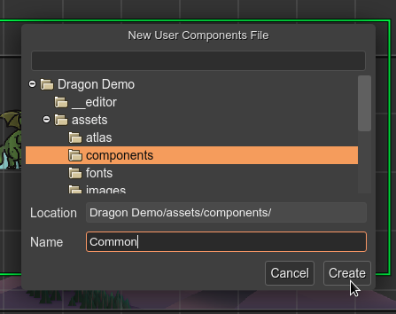

.. include:: ../_header.rst

Create a new User Components file
~~~~~~~~~~~~~~~~~~~~~~~~~~~~~~~~~

These are the steps to create a new |UserComponents|_ file:

#. Open the `New File dialog <../workbench/new-file-dialog.html>`_.

#. Select the **User Components File** option. This opens the **New User Components File** dialog.

#. In the new dialog, select the location of the new file.

#. Write the name of the new file. The ``.components`` extension is added automatically, if not set.

#. Press the **Create** button. The file will be created and opened in the |UserComponentsEditor|_.

.. warning::

    The ``*.components`` files are only used by the editor. It is recommended to exclude them from a final release of the game. Only the generated JavaScript files are relevant to the game files.