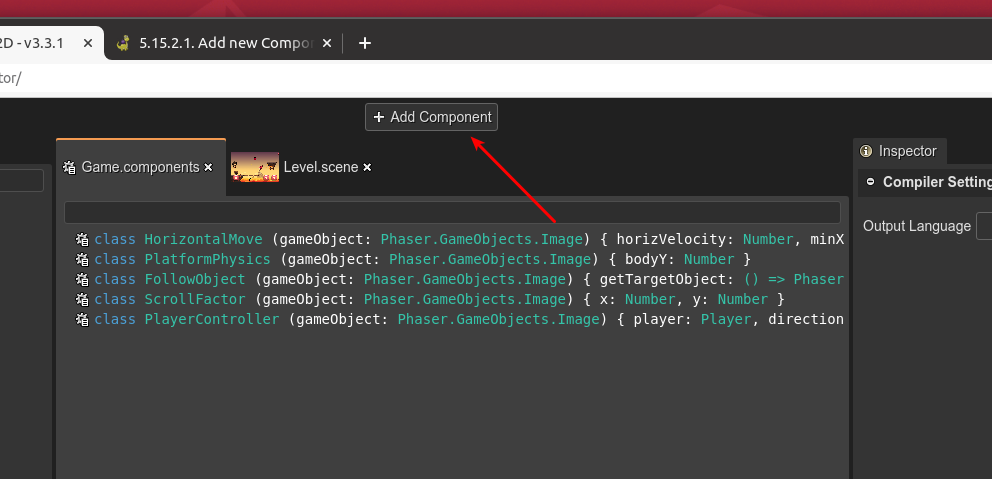

.. include:: ../_header.rst

Add new component
`````````````````

To add a new |UserComponent|_ you can: press the ``A`` key, click in the **Add Component** button in the |MainToolbar|_ or select the **Add Component** option in the context menu.



The new created component has a default name, so probably you would like to change it, in the |InspectorView|_.

As you can see in the image, the components are shown in a viewer and are rendered like class declarations: with the class name and the name and type of the properties.

To delete a component select it and press the ``Delete`` key. Or select the **Delete** option in the context menu.