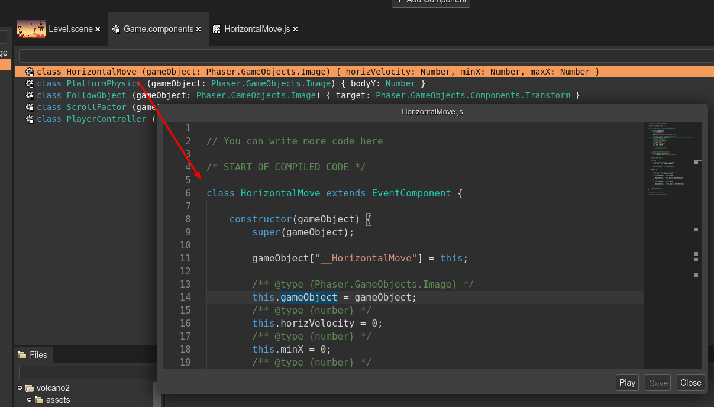
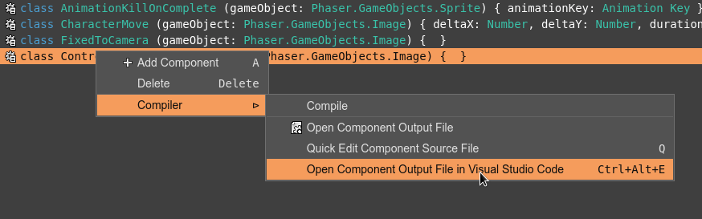

.. include:: ../_header.rst

Edit the component code
```````````````````````

To edit the `code generated <user-components-compiler.html>`_ for a component, you can double click on a component in the editor. It will open the component code file in the built-in code editor.

Also, you can select the component and press the ``Q`` key. It will open a Quick Edit dialog with a code editor:



The context menu shows all the options to edit the output file of a component:



The **Open Output File in Visual Studio Code** (``Ctrl+Alt+E``) command opens the output file in the configured external editor.