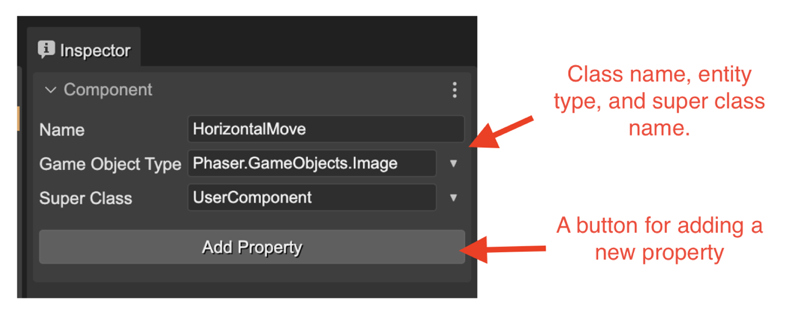
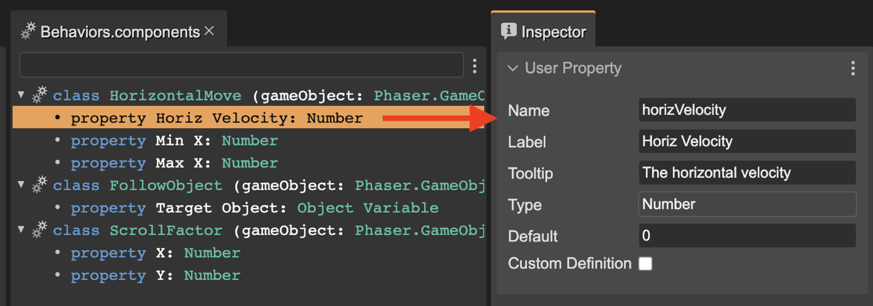

.. include:: ../_header.rst

Edit the component info
```````````````````````

A component is a class that adds state and behaviors to a game object, using composition. To edit the information of a component, you can select it in the editor and edit the values in the |InspectorView|_.

This is the component metadata you can edit:

* The name of the component class.
* The type of the game object (or entity). Next to the field, you can open a menu with common possible options.
* The super-class of the component class. It is optional. Next to the field, you can open a menu with common possible options and names used in other components.



The properties work the same as the `Prefab user properties <prefab-user-properties.html#creating-a-prefab-user-property>`_.

You can add new properties by pressing the **Add Property** button.

The above image shows the **HorizontalMove** component. It has a game object type ``Phaser.GameObjects.Image``. It means you should add this component to that type of objects (entities). And the **horizVelocity**, **minX** and **minY** properties. 

.. image:: ../images/scene-editor-user-components-props-20221101.webp
  :alt: The component's properties.

For editing the info of a property, select it in the editor and set the values in the Inspector view:




This component is compiled into this JavaScript code:

.. code::

    // You can write more code here

    /* START OF COMPILED CODE */

    class HorizontalMove {
        
        constructor(gameObject) {
            gameObject["__HorizontalMove"] = this;
            
            /** @type {Phaser.GameObjects.Image} */
            this.gameObject = gameObject;
            /** @type {number} */
            this.horizVelocity = 0;
            /** @type {number} */
            this.minX = 0;
            /** @type {number} */
            this.maxX = 3070;
            
            /* START-USER-CTR-CODE */            
            // You can write code here
            /* END-USER-CTR-CODE */
        }
        
        /** @returns {HorizontalMove} */
        static getComponent(gameObject) {
            return gameObject["__HorizontalMove"];
        }        
        
        /* START-USER-CODE */
        // You can write code here
        /* END-USER-CODE */
    }

    /* END OF COMPILED CODE */

    // You can write more code here


Check the `User Components compiler <user-components-compiler.html>`_ section to learn more about how the components are translated into JavaScript code.


