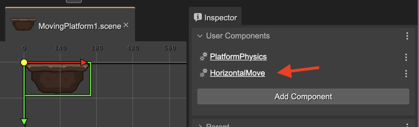
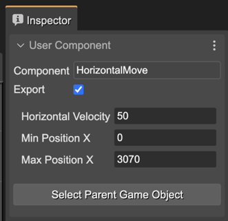
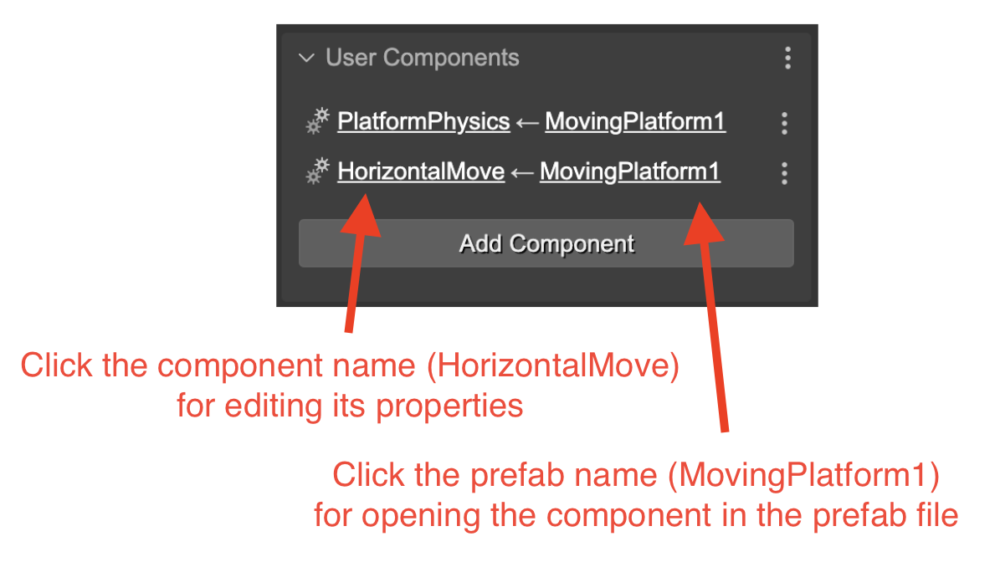
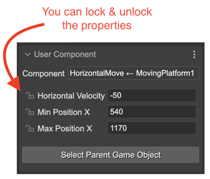
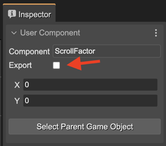
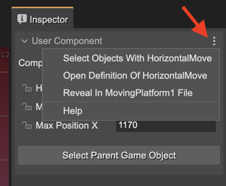

.. include:: ../_header.rst

Adding User Components to a Prefab 
~~~~~~~~~~~~~~~~~~~~~~~~~~~~~~~~~~

In the previous section we shown how you can add a user component to an object. But, what does happen if you add a user component to a prefab? It is practically the same, but this component will be present in all the prefab instances too.

Let's see this example of a moving platform prefab. It contains the **PlatformPhysics** and **HorizontalMove** components, but let's focus on the **HorizontalMove** one:

When you select an instance of this **MovingPlatform1** prefab, it also shows the **HorizontalMove** component, but highlighting that it belongs to the **MovingPlatform1** prefab:

The component's link contains the component's name and the name of the prefab it belongs to. If you click the prefab name, it opens the prefab file in a new editor, and selects the component. If you click on the component link, it selects the component and shows its properties in the |InspectorView|_. Look you can lock/unlock the properties:

Generating the code for a component in a prefab instance
^^^^^^^^^^^^^^^^^^^^^^^^^^^^^^^^^^^^^^^^^^^^^^^^^^^^^^^^

The `user components compiler <user-components-compiler.html>`_ will generate the code to changing the component's properties like this:

.. code::

		// movingPlatform2 (components)
		const movingPlatform2HorizontalMove = HorizontalMove
                                           .getComponent(movingPlatform2);
		movingPlatform2HorizontalMove.horizVelocity = -50;
		movingPlatform2HorizontalMove.minX = 540;
		movingPlatform2HorizontalMove.maxX = 1170;

Note it doesn't create the component, else it gets the component from the **movingPlatform2** prefab instance.

Hiding a component to the prefab instances
^^^^^^^^^^^^^^^^^^^^^^^^^^^^^^^^^^^^^^^^^^

Maybe you don't want to show the component of a prefab in the prefab instances. Because it is a component with local properties and behaviors and it could be perfectly hidden to the prefab instances. For doing this, you can uncheck the **Export** parameter of the component in the prefab:

Actions for a component in a prefab instance
^^^^^^^^^^^^^^^^^^^^^^^^^^^^^^^^^^^^^^^^^^^^

These are the actions associated to the user component of a prefab instance:

* **Select Objects With HorizontalMove**: selects in the scene all objects containing the **HorizontalMove** component.
* **Open Definition Of HorizontalMove**: opens the definition of the component in the `User Components Editor <./user-components-editor.html>`_.
* **Reveal in MovingPlatform1 File**: opens the prefab in a new Scene Editor and selects the **HorizontalMove** component.