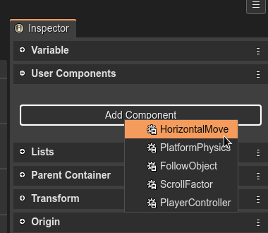
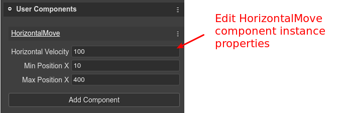
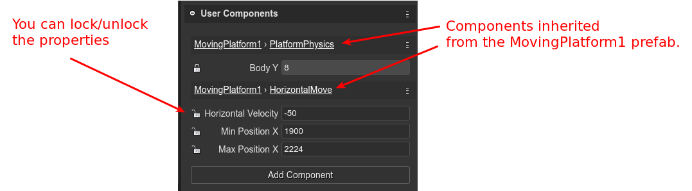
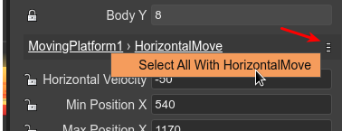

.. include:: ../_header.rst

Adding User Components to a Game Object
~~~~~~~~~~~~~~~~~~~~~~~~~~~~~~~~~~~~~~~

You can add a user component to an object (entity)  in two ways: manually, and with the |SceneEditor|_.

Adding a component to an object manually:

.. code::

    const platform = ...;
    const move = new HorizontalMove(platform);
    move.minX = 100;
    move.maxX = 400;

The constructor of the user component **HorizontalMove** adds the component to the object. You can keep a reference to the component or get the component from the game object, with the **getComponent** method:

.. code::

    const move = HorizontalMove.getComponent(platform);

However, the interesting is adding components to objects in the |SceneEditor|_.

This is possible in the **User Components** section. It shows the **Add Component** button.

When you click that button, it shows a menu with all the components defined in the project. Select the one you want to add:

Then, the properties of the components are shown in the same **User Components** section, and are ready to be set with new values:

The `user components compiler <user-components-compiler.html>`_ will generate the code to create the component, just like if you write it by hand:

.. code::

    // bridge2 (components)
    const bridge2HorizontalMove = new HorizontalMove(bridge2);
    bridge2HorizontalMove.horizVelocity = 100;
    bridge2HorizontalMove.minX = 10;
    bridge2HorizontalMove.maxX = 400;

If the selected object is a prefab instance, then the components present in the prefab are shown too, and you can lock/unlock its properties:

Look the prefab name and the |UserComponent|_ name are shown as links. If you click on it, it will open the prefab or the |UserComponent| in its editor. Also, each |UserComponent|_ panel has a menu icon. Click on it to list other options, like select in the scene all the objects with the same |UserComponent|_:

